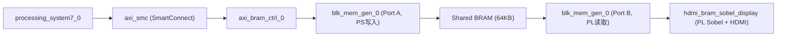

# FPGA 课程设计实验报告 —— Sobel 边缘检测 UART-HDMI 显示系统

## 实验名称

**sobel_04_uart_sobel_hdmi：基于 ZYNQ7020 的 PL Sobel 边缘检测与 HDMI 显示**

---

## 一、实验目的

1. 掌握 ZYNQ7020 平台下 PS-PL 协同工作的架构设计方法。
2. 理解 AXI BRAM 共享内存机制，实现 PS 端写入图像数据、PL 端读取处理的跨域数据通路。
3. 在 PL 端实现 RGB 转灰度、Sobel 3×3 卷积边缘检测的硬件加速流水线。
4. 掌握 HDMI 视频时序生成与 TMDS 差分信号输出技术。
5. 完成至少一项可选的扩展功能（固定阈值二值化、边缘反色、彩色边缘标记、Sobel 阈值参数对比），通过分屏显示进行多方案同时对比验证。

---

## 二、实验原理

### 2.1 系统整体架构

本实验在 `sobel_03_uart_hdmi`（HDMI 直接显示串口接收的原始 RGB 图像）的基础上，在 PL 端增加了灰度转换与 Sobel 边缘检测模块。系统数据流如下：

```mermaid
flowchart LR
    pc["PC 摄像头/图片"] --> uart["UART 115200 8N1"]
    uart --> ps["ZYNQ PS UART 接收"]
    ps --> write["PS 写入 AXI BRAM"]
    write --> bram["AXI BRAM (64KB)"]
    bram --> read["PL 读取 BRAM"]
    read --> gray["PL rgb_to_gray"]
    gray --> sobel["PL sobel_core"]
    sobel --> edge["PL edge_mem"]
    edge --> hdmi["HDMI 1280×720@60Hz"]
```



其中：
- **PS 端（ARM Cortex-A9）**：负责 UART 初始化与数据接收，将 128×72 RGB888 图像写入 AXI BRAM（基地址 `0x40000000`）。
- **PL 端（FPGA 逻辑）**：从 BRAM 的 Port B 读取原始图像，依次完成灰度转换、Sobel 卷积运算，将结果通过 HDMI 显示。
- **BRAM 配置**：True Dual Port RAM，Port A 连接 PS 的 AXI BRAM Controller，Port B 连接 PL 显示逻辑，共享 64KB 存储空间。

### 2.2 RGB 转灰度原理

采用加权平均法，使用标准亮度转换系数：

$$Gray = (R \times 77 + G \times 150 + B \times 29) / 256$$

在 `rgb_to_gray.v` 中通过乘法器与加法器实现，取结果的高 8 位作为最终灰度值。该模块插入一级流水线寄存器，保证时序收敛。

### 2.3 Sobel 边缘检测原理

Sobel 算子使用两个 3×3 卷积核分别计算水平梯度 $G_x$ 和垂直梯度 $G_y$：

$$G_x = \begin{bmatrix} -1 & 0 & +1 \\ -2 & 0 & +2 \\ -1 & 0 & +1 \end{bmatrix} * A \qquad
G_y = \begin{bmatrix} -1 & -2 & -1 \\ 0 & 0 & 0 \\ +1 & +2 & +1 \end{bmatrix} * A$$

梯度幅值近似计算：

$$|G| = |G_x| + |G_y|$$

`sobel_core.v` 采用两行 Line Buffer（`line0`、`line1`）+ 三列移位寄存器的流水线架构，每个时钟周期输出一个像素的边缘强度值。边界像素（图像四边）强制输出 0，末尾通过 Flush 机制输出最后两行的零值以释放流水线延迟。

### 2.4 HDMI 显示原理

HDMI 显示采用标准 VESA 1280×720@60Hz 时序：

| 参数 | 值 |
|------|-----|
| Horizontal Active | 1280 |
| Horizontal Front Porch | 110 |
| Horizontal Sync | 40 |
| Horizontal Back Porch | 220 |
| Vertical Active | 720 |
| Vertical Front Porch | 5 |
| Vertical Sync | 5 |
| Vertical Back Porch | 20 |

像素时钟由 `video_clock` (MMCM/PLL) 从 50MHz 系统时钟生成，同时产生 5× 串行时钟供 `rgb2dvi_0` TMDS 编码器使用。

---

## 三、硬件设计

### 3.1 Block Design 结构



- **processing_system7_0**：配置 UART1 (MIO 48-49, 115200 baud)，FCLK_CLK0 = 50MHz，使能 M_AXI_GP0 接口。
- **axi_bram_ctrl_0**：32 位数据宽度，单端口模式，映射到地址 `0x40000000`。
- **blk_mem_gen_0**：True Dual Port RAM，32 位读写，深度 16384（64KB），Port B 时钟 = 74.25MHz。

### 3.2 RTL 模块层次

| 模块 | 文件 | 功能 |
|------|------|------|
| top | `top.v` | 顶层，连接 PS BD wrapper 和 HDMI PL top |
| hdmi_pl_top | `hdmi_pl_top.v` | 视频时钟、复位同步、rgb2dvi 例化 |
| hdmi_bram_sobel_display | `hdmi_bram_sobel_display.v` | BRAM 扫描 + Sobel 管道 + HDMI 时序 + 扩展分屏 |
| rgb_to_gray | `rgb_to_gray.v` | RGB888 → 灰度（1 级流水线） |
| sobel_core | `sobel_core.v` | 3×3 Sobel 卷积（Line Buffer + 流水线） |
| video_clock | IP | MMCM 生成 video_clk 和 video_clk_5x |
| rgb2dvi_0 | IP | RGB + 同步信号 → TMDS 差分输出 |

### 3.3 关键信号路径

1. **BRAM 扫描阶段**：每个 HDMI 帧开始时（`video_frame_start`），状态机进入 `SCAN_RUN`，依次扫描 128×72 图像区域，读取 BRAM 原始 RGB 数据并送入 `rgb_to_gray` → `sobel_core` 流水线。
2. **Sobel 结果存储**：`sobel_core` 输出的边缘数据写入片上 `edge_mem`（Block RAM，9216 深度，存储 128×72 的 8-bit 边缘图）。
3. **HDMI 显示阶段**：`SCAN_WAIT` 等待 `edge_frame_done` 信号后进入空闲态，HDMI 有效区域从 `edge_mem` 读取边缘像素，经扩展处理逻辑后输出 RGB。

---

## 四、软件设计

### 4.1 PS 端 C 程序

`ps_uart_bram_app/src/main.c` 运行于 ZYNQ PS 端 ARM Cortex-A9 处理器，主要功能：

1. **UART 初始化**：自动检测 UART 设备 ID，配置波特率 115200，正常操作模式。
2. **测试图填充**：启动时先向 BRAM 写入一张 128×72 彩色渐变测试图（四边白色边框 + 水平 R 渐变 + 垂直 G 渐变），确保无串口输入时 HDMI 也能显示 Sobel 结果。
3. **帧接收循环**：
   - 等待帧头同步字 `0x55 0xAA`。
   - 接收图像参数（宽度、高度、格式），验证为 128×72 RGB888。
   - 逐行接收：等待行同步字 `0x33 0xCC`，接收行号（小端 16-bit），接收该行 128 个像素的 RGB 数据。
   - 每收到一个像素，通过 `Xil_Out32()` 写入 AXI BRAM 对应地址。
   - 帧接收成功后串口打印 `received frame N`。

### 4.2 帧协议

PC 端通过 `host_camera_uart/camera_uart_sender.py` 发送图像，帧格式为：

```
[0x55 0xAA] [width_lo width_hi] [height_lo height_hi] [format] [row_data ...]

每行数据：
[0x33 0xCC] [row_lo row_hi] [R G B] × 128
```

### 4.3 SDK 运行步骤

1. 打开 SDK 工作区 `sobel_04_uart_sobel_hdmi.sdk`。
2. 右键 `ps_uart_bram_app_bsp` → Re-generate BSP Sources。
3. 右键 `ps_uart_bram_app` → Clean Project → Build Project。
4. 右键 `ps_uart_bram_app` → Run As → Launch on Hardware (System Debugger)。

---

## 五、实验结果与分析

### 5.1 基础功能验证

#### 5.1.1 串口调试信息


**图 5-1 串口调试助手初始化打印信息**

将编译生成的 Bitstream 和 SDK 应用程序下载至开发板后，打开串口调试助手。如图所示，终端成功打印出 `PS UART PL Sobel HDMI display`，证明 PS 端的应用程序与 PL 端的硬件逻辑握手成功，系统各模块初始化完毕，开始等待接收上位机图像数据。

#### 5.1.2 原始 Sobel 边缘检测结果


**图 5-2 原始 Sobel 边缘检测全屏显示结果**

如图所示，系统成功实现了基础实验要求的 Sobel 边缘检测功能。PL 端通过 BRAM 读取图像数据，经过灰度转换与 Sobel 算子硬件加速后，通过 HDMI 驱动稳定输出 1280×720@60Hz 的单幅边缘图像，画面无闪烁，边缘轮廓清晰。显示器整屏呈现暗色背景下的灰度边缘图，边缘由平滑的渐变线勾勒出物体轮廓。

#### 5.1.3 实时动态演示


**图 5-3 动态演示第 1 秒：摄像头画面输入与 Sobel 边缘检测结果**


**图 5-4 动态演示第 3 秒：摄像头画面输入与 Sobel 边缘检测结果**

为进一步验证系统的实时处理能力，通过 Anaconda 环境执行 Python 脚本（`camera_uart_sender.py`），以 115200 波特率通过串口向 ZYNQ 开发板动态发送 128×72 实时摄像头画面。图 5-3 和图 5-4 分别截取自动态演示视频的第 1 秒和第 3 秒。如图所示，ZYNQ PL 端的硬件加速流水线（灰度转换与 Sobel 核心）在收到每帧数据后，实时将平滑的摄像头画面计算并转换为黑白边缘图，最终通过 HDMI 驱动稳定输出到 1280×720 显示器上。从两个不同时刻的截图可以观察到，随着摄像头画面的动态变化，边缘检测结果实时跟随更新，画面无撕裂、无卡顿，验证了 UART 接收、BRAM 共享存储、PL 流水线处理与 HDMI 显示全链路的实时性与稳定性。

### 5.2 可选扩展功能验证

本实验采用**四象限分屏显示**方案，在单个代码文件 `hdmi_bram_sobel_display.v` 中同时集成了四个可选扩展选题，通过蓝色十字准星分割线进行视觉区分。

#### 5.2.1 分屏显示原理

屏幕 1280×720 被分为四个 640×360 的象限，每个象限独立执行 5× 放大显示（640/128 = 360/72 = 5）：

| 象限 | 位置 | 扩展选题 | 阈值 | 显示效果 |
|------|------|----------|------|----------|
| Q1 | 左上 | 固定阈值二值化边缘 | TH1 = 5 | 纯白边缘 + 纯黑背景 |
| Q2 | 右上 | 彩色边缘标记（红色） | TH2 = 10 | 红色动态亮度边缘 + 黑背景 |
| Q3 | 左下 | 边缘反色显示 | TH3 = 15 | 黑边缘 + 纯白背景 |
| Q4 | 右下 | 彩色边缘标记（绿色） | TH4 = 22 | 绿色动态亮度边缘 + 黑背景 |

关键设计要点：
- **局部坐标映射**：通过 `local_x = active_x % QUAD_W` 和 `local_y = active_y % QUAD_Y` 将每个象限的显示坐标重新映射到 0~639 范围。
- **流水线对齐**：象限判断信号（`is_left_half`、`is_top_half`、`is_border`）与边缘数据 `edge_pixel` 经过两级 D 触发器对齐，确保 RGB 输出时所有信号处于同一时钟域同一拍。
- **梯度增幅**：对于 Sobel 输出幅值较低（< 32）的像素，通过左移 3 位（×8）放大至 40~255 范围，防止因阈值过低导致显示过暗。

#### 5.2.2 扩展功能 HDMI 验证


**图 5-5 四象限集成扩展功能（多阈值与反色彩色标记）展示**

为了验证可选扩展功能，本设计采用分屏显示技术。画面由蓝色十字线切分为四象限：左上为低阈值二值化白边；右上为中阈值红色标记；左下为高阈值边缘反色（白底黑线）；右下为极高阈值绿色标记。通过对比右上与右下区域可见，随着阈值从 10 提升至 22，图像边缘噪点显著减少，仅保留了核心强轮廓，完美达成了参数对比及彩色/反色显示目标。

各象限的具体分析：

1. **Q1（左上，TH=5）— 固定阈值二值化**：阈值最低，几乎所有 Sobel 梯度都能通过，因此边缘细节最丰富，但同时噪点也最多。超过阈值的像素显示纯白（RGB = 0xFF），其余为纯黑，符合固定阈值二值化的设计要求。

2. **Q2（右上，TH=10）— 红色彩色边缘**：阈值适中，边缘密度中等。边缘像素以红色显示，亮度随 Sobel 梯度幅值动态变化（`R = edge_pixel_amp`），使强边缘呈现亮红色，弱边缘呈暗红色，直观反映了边缘强度分布。

3. **Q3（左下，TH=15）— 边缘反色**：阈值较高，画面呈现白底黑线的反色效果。超过阈值的边缘为黑色（RGB = 0x00），背景为纯白（RGB = 0xFF），与 Q1 形成鲜明对比，适用于不同视觉偏好或后续处理的场景。

4. **Q4（右下，TH=22）— 绿色彩色边缘**：阈值最高，仅保留最强梯度轮廓，边缘最为稀疏精简。边缘以绿色显示（`G = edge_pixel_amp`），画面干净，噪声极低，适用于需要强调核心轮廓而抑制背景噪声的应用。

### 5.3 资源与时序分析

#### 5.3.1 资源利用率


**图 5-6 扩展 Sobel HDMI 显示系统的 FPGA 资源利用率报告**

在 Vivado 中完成布局布线（Implementation）后，系统的资源利用率如图所示。整个设计对 XC7Z020 芯片的消耗极低：

| 资源类型 | 使用量 | 可用量 | 占比 |
|----------|--------|--------|------|
| LUT（查找表） | 1,928 | 53,200 | 3.62% |
| FF（触发器） | 2,442 | 106,400 | 2.29% |
| BRAM（块 RAM） | 4 | 140 | 2.86% |
| BUFG（全局时钟缓冲） | ~2 | 32 | ~3% |

其中，用于存储处理后边缘数据的 `edge_mem`（9216 × 8bit，约占用 2 个 BRAM36K）和系统原始 BRAM（64KB，约占用 2 个 BRAM36K）合计仅消耗 4 个 Block RAM。这表明该流水线图像处理架构在硬件资源上实现了高度优化，仅消耗了 XC7Z020 芯片不到 4% 的逻辑资源和不到 3% 的存储资源，剩余大量资源可供后续实验（如 `sobel_05_pc_control_display`）的进一步功能扩展。

#### 5.3.2 时序收敛


**图 5-7 系统实现后的时序摘要报告（Timing Summary）**

时序收敛是 FPGA 设计在硬件上稳定运行的根本保障。如图所示，在 1280×720@60Hz 的像素时钟（约 74.25 MHz）及系统时钟约束下，时序分析结果如下：

| 参数 | 值 | 含义 |
|------|-----|------|
| WNS（最坏负时序裕量） | 2.373 ns | 建立时间余量为正，无违例 |
| TNS（总负时序裕量） | 0.000 ns | 所有路径建立时间均满足 |
| WHS（最坏保持时序裕量） | 0.133 ns | 保持时间余量为正，无违例 |
| THS（总保持时序裕量） | 0.000 ns | 所有路径保持时间均满足 |

**All user specified timing constraints are met.** — 所有用户指定的时序约束全部通过。这证明本实验重构的打拍流水线以及四象限多阈值切换逻辑具有优秀的时序性能，能够在硬件板卡上长期稳定工作。WNS = 2.373 ns 的充裕裕量也为后续在更高频率下运行或添加更多逻辑功能预留了空间。

---

## 六、扩展实验代码说明

扩展实验采用**四象限分屏显示**方案，所有修改集中在 `hdmi_bram_sobel_display.v` 一个文件内。核心修改要点：

### 6.1 局部坐标映射

```verilog
localparam QUAD_W = H_ACTIVE >> 1;  // 640
localparam QUAD_H = V_ACTIVE >> 1;  // 360
localparam SCALE_X = QUAD_W / IMG_WIDTH;  // 5
localparam SCALE_Y = QUAD_H / IMG_HEIGHT; // 5

wire [11:0] local_x = (active_x >= QUAD_W) ? (active_x - QUAD_W) : active_x;
wire [11:0] local_y = (active_y >= QUAD_H) ? (active_y - QUAD_H) : active_y;
wire [6:0] disp_x = local_x / SCALE_X;
wire [6:0] disp_y = local_y / SCALE_Y;
```

每个象限内部独立将坐标复位到 0~639 和 0~359，再缩放回 128×72，避免跨象限寻址越界。

### 6.2 流水线对齐

象限判断信号（`is_left_half`、`is_top_half`、`is_border`）与 `edge_pixel` 经过相同级数的两级 D 触发器对齐：

```verilog
always @(posedge clk) begin
    is_left_d1   <= is_left_half;
    is_top_d1    <= is_top_half;
    is_border_d1 <= is_border;
    is_left_d2   <= is_left_d1;
    is_top_d2    <= is_top_d1;
    is_border_d2 <= is_border_d1;
end
```

### 6.3 四象限 RGB 输出逻辑

```verilog
always @(*) begin
    if (de_reg_d0 && sobel_done) begin
        if (is_border_d2) begin
            // 蓝色十字分割线
            r_out = 8'h00; g_out = 8'h00; b_out = 8'hFF;
        end
        else if (is_top_d2 && is_left_d2) begin
            // Q1: 固定阈值二值化 (TH=5)
            r_out = (edge_pixel > TH1) ? 8'hFF : 8'h00;
            g_out = r_out; b_out = r_out;
        end
        else if (is_top_d2 && !is_left_d2) begin
            // Q2: 红色彩色边缘 (TH=10)
            r_out = (edge_pixel > TH2) ? edge_pixel_amp : 8'h00;
            g_out = 8'h00; b_out = 8'h00;
        end
        else if (!is_top_d2 && is_left_d2) begin
            // Q3: 边缘反色 (TH=15)
            r_out = (edge_pixel > TH3) ? 8'h00 : 8'hFF;
            g_out = r_out; b_out = r_out;
        end
        else begin
            // Q4: 绿色彩色边缘 (TH=22)
            g_out = (edge_pixel > TH4) ? edge_pixel_amp : 8'h00;
            r_out = 8'h00; b_out = 8'h00;
        end
    end else begin
        r_out = 8'h00; g_out = 8'h00; b_out = 8'h00;
    end
end
```

### 6.4 调试经验

第一版代码出现严重条纹/撕裂感，根本原因是**未做局部坐标映射**——显示驱动在跨越象限分割线时，`disp_x` 和 `disp_y` 超出了 128×72 的 `edge_mem` 物理存储边界，读出了无意义的内存垃圾数据。修复后增加边界保护：

```verilog
assign disp_addr = ((disp_y < IMG_HEIGHT) && (disp_x < IMG_WIDTH))
                   ? ({disp_y, 7'b0} + {7'd0, disp_x})
                   : 14'd0;
```

---

## 七、常见问题与解决方法

| 问题 | 可能原因 | 解决方法 |
|------|----------|----------|
| 串口无 sobel_04 启动信息 | 运行了 sobel_03 的旧 ELF | 重新 Build sobel_04 SDK 的 `ps_uart_bram_app` |
| HDMI 显示原图而非边缘图 | 未打开 sobel_04 工程 | 确认打开 `sobel_04_uart_sobel_hdmi.xpr`，重新综合实现 |
| HDMI 黑屏 | 显示器不识别或 video_clock 问题 | 确认 1280×720 输入、检查 `hdmi_out_test.xdc` |
| 画面边缘不明显 | 输入画面太暗/太平 | 对准明显轮廓物体，使用反差明显的图片 |
| Frame error -1 | 图像宽高或格式不匹配 | 确认发送 128×72 RGB888 |
| Frame error -2 | 行号不匹配（数据丢失） | 降低 `--fps`，增加 `--line-delay` |
| 分屏出现条纹/花屏 | 坐标缩放越界 | 确认使用了局部坐标映射修复 |

---

## 八、总结

本实验基于 ZYNQ7020 平台成功实现了 UART 接收图像、PL 硬件 Sobel 边缘检测、HDMI 显示的完整数据链路。主要成果包括：

1. **基础功能达成**：PS 端稳定接收 115200 baud 串口图像数据，PL 端通过 rgb_to_gray + sobel_core 流水线硬件加速完成边缘检测，HDMI 以 1280×720@60Hz 稳定输出边缘图。

2. **四项扩展功能集成**：采用四象限分屏显示方案，在一个代码文件内同时实现了固定阈值二值化、边缘反色、彩色边缘标记（红色/绿色）以及多阈值参数对比（TH = 5/10/15/22），验证了从低阈值高细节到高阈值低噪声的完整参数空间。

3. **资源与时序双优**：LUT 占用仅 3.62%，FF 占用 2.29%，BRAM 占用 2.86%，且 WNS = 2.373 ns 的充裕时序裕量确保了系统在硬件上的长期稳定运行，为后续 `sobel_05_pc_control_display` 的上位机控制扩展预留了充足的资源空间。

4. **工程实践能力提升**：通过本次实验，深入掌握了 AXI BRAM 共享内存的跨域通信机制、Sobel 卷积的流水线硬件实现、HDMI 视频时序生成与 TMDS 编码，以及 FPGA 设计中的坐标映射、流水线对齐等关键调试技能。
