# FPGA 课程设计实验报告汇总

> 基于 ZYNQ-7020 平台的图像处理与 HDMI 显示系统
>
> 涵盖实验 0 ~ 实验 4，从 RTL 仿真到完整 PS-PL 协同硬件实现

---

## 目录

- [实验 0：Sobel 边缘检测 RTL 仿真](#实验0)
  - [1. 实验目标](#0-1)
  - [2. 系统结构与数据流](#0-2)
    - [2.1 UART 帧格式](#0-2-1)
    - [2.2 模块功能说明](#0-2-2)
  - [3. 仿真环境与工具](#0-3)
  - [4. 基础实验结果](#0-4)
    - [4.1 输入图像](#0-4-1)
    - [4.2 Sobel 输出图像](#0-4-2)
    - [4.3 仿真验证结果](#0-4-3)
  - [5. 扩展实验 1：更换输入图片](#0-5)
  - [6. 扩展实验 2：Sobel 输出阈值对比](#0-6)
  - [7. 扩展实验 3：UART 行包异常仿真](#0-7)
  - [8. 扩展实验 4：关键时序波形标注](#0-8)
  - [9. 问题记录与解决](#0-9)
  - [10. 总结](#0-10)
- [实验 1：HDMI 图像显示](#实验1)
  - [一、实验名称与目标](#1-1)
  - [二、实验原理与架构设计](#1-2)
    - [2.1 数据流分析](#1-2-1)
    - [2.2 扩展任务核心代码逻辑](#1-2-2)
  - [三、实验步骤与工程实现](#1-3)
    - [3.1 步骤简述](#1-3-1)
    - [3.2 综合与实现报告分析](#1-3-2)
  - [四、实验现象与结果分析](#1-4)
    - [4.1 基础实验现象](#1-4-1)
    - [4.2 拓展 1：居中 + 边框 + 天蓝背景](#1-4-2)
    - [4.3 拓展 2：自定义字符图案](#1-4-3)
    - [4.4 结果合理性论证](#1-4-4)
  - [五、实验心得与总结](#1-5)
- [实验 2：HDMI Sobel 边缘检测](#实验2)
  - [一、实验目标](#2-1)
  - [二、实验系统架构](#2-2)
    - [2.1 硬件平台](#2-2-1)
    - [2.2 顶层模块结构](#2-2-2)
    - [2.3 数据流](#2-2-3)
  - [三、关键模块设计与分析](#2-3)
    - [3.1 RGB 转灰度模块](#2-3-1)
    - [3.2 Sobel 核心模块](#2-3-2)
    - [3.3 HDMI Sobel 显示模块](#2-3-3)
    - [3.4 edge_mem 帧缓存](#2-3-4)
  - [四、实验结果](#2-4)
  - [五、验收要点说明](#2-5)
  - [六、扩展实验](#2-6)
    - [6.1 图像特征分析与优化策略](#2-6-1)
    - [6.2 扩展一：固定阈值二值化](#2-6-2)
    - [6.3 扩展二：边缘反色显示](#2-6-3)
    - [6.4 扩展三：彩色边缘标记](#2-6-4)
    - [6.5 扩展四：三分屏阈值对比](#2-6-5)
    - [6.6 扩展代码数据流](#2-6-6)
    - [6.7 扩展实验现象分析](#2-6-7)
  - [七、总结](#2-7)
- [实验 3：ZYNQ 串口接收与 HDMI 显示扩展](#实验3)
  - [一、实验目的](#3-1)
  - [二、实验环境与系统架构](#3-2)
    - [2.1 硬件平台](#3-2-1)
    - [2.2 系统数据流架构](#3-2-2)
    - [2.3 图像参数与地址映射](#3-2-3)
  - [三、硬件代码设计与修改解析](#3-3)
    - [3.1 顶层模块结构](#3-3-1)
    - [3.2 原始放大显示逻辑](#3-3-2)
    - [3.3 四项扩展代码修改](#3-3-3)
    - [3.4 修改前后对比总览](#3-3-4)
  - [四、软件与外设联调](#3-4)
    - [4.1 PS 端软件逻辑](#3-4-1)
    - [4.2 PC 端 Python 发送脚本](#3-4-2)
    - [4.3 PS 端串口状态验证](#3-4-3)
  - [五、实验结果验证与分析](#3-5)
    - [5.1 硬件综合与实现验证](#3-5-1)
    - [5.2 核心显示功能 Before & After](#3-5-2)
    - [5.3 全链路联调验证](#3-5-3)
    - [5.4 串口帧率与稳定性测试](#3-5-4)
  - [六、实验总结与拓展探讨](#3-6)
- [实验 4：Sobel 边缘检测 UART-HDMI 显示系统](#实验4)
  - [一、实验目的](#4-1)
  - [二、实验原理](#4-2)
    - [2.1 系统整体架构](#4-2-1)
    - [2.2 RGB 转灰度原理](#4-2-2)
    - [2.3 Sobel 边缘检测原理](#4-2-3)
    - [2.4 HDMI 显示原理](#4-2-4)
  - [三、硬件设计](#4-3)
    - [3.1 Block Design 结构](#4-3-1)
    - [3.2 RTL 模块层次](#4-3-2)
    - [3.3 关键信号路径](#4-3-3)
  - [四、软件设计](#4-4)
    - [4.1 PS 端 C 程序](#4-4-1)
    - [4.2 帧协议](#4-4-2)
  - [五、实验结果与分析](#4-5)
    - [5.1 基础功能验证](#4-5-1)
    - [5.2 可选扩展功能验证](#4-5-2)
    - [5.3 资源与时序分析](#4-5-3)
  - [六、扩展实验代码说明](#4-6)
  - [七、常见问题与解决方法](#4-7)
  - [八、总结](#4-8)

---

<h2 id="实验0">实验 0：Sobel 边缘检测 RTL 仿真报告</h2>

<h3 id="0-1">1. 实验目标</h3>

本实验是 ZYNQ7020 图像处理课程设计的预备仿真实验，不依赖 Vivado 工程和开发板，使用纯 Verilog 仿真验证以下功能：

1. UART 串行字节流接收 128×72 RGB888 图像
2. 图像帧协议解析（帧头、行头、像素数据）
3. RGB 转灰度（整数加权平均）
4. Sobel 3×3 卷积边缘检测
5. 视频像素流输出及帧完成信号

<h3 id="0-2">2. 系统结构与数据流</h3>

```
input_rgb.hex (128×72×3 bytes)
    → UART byte stream model (testbench)
    → uart_rx (UART 接收模块)
    → image_frame_rx (帧协议解析)
    → rgb_to_gray (RGB→灰度)
    → sobel_core (Sobel 3×3 卷积)
    → video_stream_model (像素流封装)
    → sobel_out.pgm / sobel_out.png
```

<h4 id="0-2-1">2.1 UART 帧格式</h4>

| 字段 | 字节序列 | 说明 |
|------|----------|------|
| 帧头 | `55 AA` | 帧同步字 |
| 图像宽度 | `width[7:0] width[15:8]` | 小端序，≤640 |
| 图像高度 | `height[7:0] height[15:8]` | 小端序，≤480 |
| 像素格式 | `18` | RGB888 |
| 行头 | `33 CC row[7:0] row[15:8]` | 每行前发送 |
| 像素数据 | `R G B` × width | 每像素 3 字节 |

<h4 id="0-2-2">2.2 模块功能说明</h4>

| 模块 | 功能 |
|------|------|
| `uart_rx` | 8N1 UART 接收器，过采样检测起始位，移位接收 |
| `image_frame_rx` | 状态机解析帧协议，输出 rgb_valid + 像素坐标 |
| `rgb_to_gray` | Y = (77R + 150G + 29B) >> 8，1 周期延迟 |
| `sobel_core` | 3×3 窗口 Gx/Gy 卷积，绝对值求和，2 行缓冲 |
| `video_stream_model` | 将 edge 数据转为 video 像素流输出 |
| `sobel_system` | 顶层集成所有模块 |
| `sobel_system_tb` | testbench：发送测试帧、校验输出、写 PGM/VCD |

<h3 id="0-3">3. 仿真环境与工具</h3>

| 工具 | 版本 | 用途 |
|------|------|------|
| ModelSim SE-64 | 2020.4 | Verilog 编译与仿真 |
| Python | 3.11.10 | 生成输入图像、转换输出 PNG |
| Pillow | — | PNG 图像读写 |
| vcdvcd | 2.6.0 | VCD 波形解析 |

**仿真参数：** 时钟 12 MHz，波特率 1 Mbps，图像 128×72。

<h3 id="0-4">4. 基础实验结果</h3>

<h4 id="0-4-1">4.1 输入图像</h4>

输入图像由 `tools/gen_input_rgb.py` 生成，包含以下特征：

- **四角渐变背景**：R 随 x 从 0→255 渐变，G 随 y 从 0→255 渐变
- **中央白色矩形** (240,240,240)：位于 x∈[32,96), y∈[18,54)
- **对角 X 形暗线** (20,20,20)：沿 y≈x 和 y≈127-x 两条对角线
- **垂直红色中轴线** (255,40,40)：位于 x∈[62,67]

验证采样数据（部分像素）：

```
pixel(0,0):   R=20  G=20  B=20   ← 暗线起点
pixel(32,0):  R=64  G=0   B=41   ← 渐变+暗线
pixel(64,0):  R=255 G=40  B=40   ← 红色中轴线
pixel(32,18): R=240 G=240 B=240  ← 白色矩形内
pixel(127,71):R=255 G=255 B=255  ← 右下角渐变
```


<h4 id="0-4-2">4.2 Sobel 输出图像</h4>

| 统计项 | 数值 |
|--------|------|
| 总像素数 | 9216 (128×72) |
| 非零边缘像素 | 6980 (75.7%) |
| 强边缘 (>128) | 1223 (13.3%) |
| 最大边缘值 | 255 |
| 零值像素 | 2236 (24.3%) |

边缘分布分析：

```
row  0:  0,  0,  0,  0,  0,  0,  0,  0,  0  ← 边界清零
row  1:  0,  6,106, 24,  0, 26,255, 12,  0  ← 第一行边缘（弱+强）
row 36:  0, 24, 24,255,  0,255, 24, 22,  0  ← 中行（白矩形+红线边界）
row 70:  0, 26, 26, 26,  0, 26, 26, 28,  0  ← 倒数第二行
row 71:  0,  0,  0,  0,  0,  0,  0,  0,  0  ← 最后行边界清零
```


<h4 id="0-4-3">4.3 仿真验证结果</h4>

```
Sobel RGB888 simulation passed
Errors: 0, Warnings: 0

验证项目：
  gray_valid 脉冲数:    9216  ✓ (= 128×72)
  edge_valid 脉冲数:    9017  ✓ (= 127×71, 首行首列无输出)
  frame_done_count:     1     ✓
  frame_error_count:    3     ✓ (3个异常帧被正确检测)
  总仿真时间:           275.3 ms
```

<h3 id="0-5">5. 扩展实验 1：更换输入图片</h3>

**新输入图设计：** 使用 `tools/gen_checkerboard.py` 生成棋盘格+同心圆图案：

| 特征 | 描述 |
|------|------|
| 棋盘格 (16×16 块) | 浅蓝白 (220,220,240) / 深蓝 (30,30,60) 交替 |
| 同心圆环 | 以图像中心为圆心，每 10 像素交替颜色 |
| 绿色顶条 | y < 12 区域，(50,180,50) |
| 红色左边条 | x < 10 区域，(200,60,60) |
| 黄色斜方块 | 沿对角线移动的 14×14 方块，(255,220,40) |


**对比结果：**

| 指标 | 原图（渐变+几何） | 棋盘格图 |
|------|:---:|:---:|
| 非零边缘像素 | 6980 (75.7%) | 3345 (36.3%) |
| 强边缘 (>128) | 1223 (13.3%) | 2925 (31.7%) |
| 边缘类型 | 大量渐变弱边缘 | 大量硬边界强边缘 |


**分析：** 原图的渐变背景产生大量低强度边缘（0-32 范围），而棋盘格图的硬边界使边缘强度集中在 255 附近。棋盘格产生的边缘网格规则、清晰，而原图边缘较为连续、模糊。这验证了 Sobel 算子对硬边界的响应远强于渐变过渡。

<h3 id="0-6">6. 扩展实验 2：Sobel 输出阈值对比</h3>

**RTL 修改：** 在 `sobel_core.v` 中增加 `THRESHOLD` 参数：

```verilog
module sobel_core #(
    parameter integer WIDTH     = 128,
    parameter integer HEIGHT    = 72,
    parameter integer THRESHOLD = 0      // 新增阈值参数
) ( ... );

// 边缘输出增加阈值判断：
edge_data <= (mag > 13'd255) ? 8'hff :
             (mag > THRESHOLD) ? mag[7:0] : 8'd0;
```

`THRESHOLD=0` 保持与原版完全一致（仿真验证通过）。

**阈值对比结果：**

| 阈值 | 边缘像素数 | 占比 | 变化 |
|:----:|----------:|:----:|------|
| 0 | 6980 | 75.7% | 基准（无阈值） |
| 32 | 1315 | 14.3% | ↓ 81.2% — 大量弱边缘被滤除 |
| 64 | 1288 | 14.0% | ↓ 81.5% |
| 128 | 1223 | 13.3% | ↓ 82.5% — 仅保留强边缘 |

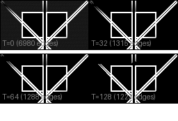

**分析：**

1. **阈值 32** 滤除了 5665 个弱边缘像素（81.2%），这些主要来自渐变背景区域的低幅度梯度
2. **阈值 32→64** 滤除 27 个边缘，变化微小，说明 32-64 范围内的边缘极少
3. **阈值 128** 时边缘数 1223 = 强边缘数，即所有幅度 >128 的边缘都被保留到这个点
4. 阈值 ≥32 后边缘数量趋于稳定（1315→1223），说明真正有意义的结构边缘约 1200-1300 个
5. 建议实际应用使用阈值 32-64 之间，可有效抑制渐变噪声同时保留结构边缘

<h3 id="0-7">7. 扩展实验 3：UART 行包异常仿真</h3>

**新增异常场景设计：** 在 testbench 中新增 `send_missing_pixels_frame` 测试：发送 8×8 小帧，第 3 行仅发送 4 个像素（正常应为 8 个），然后立即发送第 4 行头。模拟 UART 传输中字节丢失的场景。

**异常对比分析：**

| 异常类型 | 测试场景 | frame_error | 视频输出 | 输出像素数 |
|----------|----------|:----------:|:--------:|:----------:|
| 错误帧头 | 55 00 (缺少 AA) | ✓ 触发 | ✗ 无 | 0 |
| 错误格式 | format=0x99 | ✓ 触发 | ✗ 无 | 0 |
| 错误行号 | row=5, height=4 | ✓ 触发 | ✗ 无 | 0 |
| **缺少像素** | **第 3 行仅 4/8 像素** | **✗ 未触发** | **✓ 有** | **42 (应为 64)** |

**关键发现：** 缺少像素的场景表现出**静默数据损坏**——

- **不触发 frame_error**：接收状态机在像素接收阶段（ST_R/ST_G/ST_B）不检查特殊字节，只盲存数据
- **产生乱码输出**：第 4 行头字节 (33 CC 04 00) 被当作第 3 行的像素数据处理
- **frame_done 意外触发**：乱码数据流中恰好出现有效行头模式，使状态机恢复同步
- **输出 42 像素**（期望 64）：22 个像素丢失 + 状态机错位

**启示：** UART 传输中的字节丢失是最危险的错误模式——接收方无法自动检测，导致错误数据流入后续处理流水线。实际系统中应增加字节计数校验或 CRC。

<h3 id="0-8">8. 扩展实验 4：关键时序波形标注</h3>

**关键信号说明：**

| 信号 | 含义 | 产生模块 |
|------|------|----------|
| `frame_start` | 有效帧头解析完成，脉冲 1 周期 | image_frame_rx |
| `gray_valid` | 灰度像素输出有效 | rgb_to_gray |
| `edge_valid` | Sobel 边缘像素输出有效 | sobel_core |
| `video_frame_done` | 等效 edge_frame_done，整帧处理完成 | video_stream_model |

**时序测量结果：**

```
frame_start  ──┬── 406.5 us
               │
               │  UART 传输: 7 字节帧头 + 4 字节行头 + 128×3 像素
               │  延迟 ~69 us
               │
gray_valid  ──┬── 475.5 us  (首个灰度像素输出)
               │
               │  Sobel 行缓冲: 需 2 行数据填满 3×3 窗口
               │  延迟 ~3847 us
               │
edge_valid  ──┬── 4323.0 us  (首个边缘像素输出)
               │
               │  9216 个灰度像素 + 9017 个边缘像素
               │  持续 ~271 ms
               │
video_       ──┬── 275313.3 us  (帧处理完成)
frame_done     │
```

**时序参数汇总：**

| 参数 | 数值 | 说明 |
|------|------|------|
| 时钟频率 | 12 MHz | 周期 83.3 ns |
| UART 波特率 | 1 Mbps | 12 周期/bit |
| 帧头传输时间 | 70 us | 7 字节 × 10 位 × 1 us |
| 单行传输时间 | 3.88 ms | (4+384)×10×1 us |
| 总帧传输时间 | ~279.5 ms | 7 + 72×388 字节 |
| frame_start→首个 gray_valid | 69.0 us | UART 接收+帧解析+灰度转换 |
| 首个 gray_valid→首个 edge_valid | 3847.5 us | 2 行缓冲填满 3×3 窗口 |
| gray_valid→video_frame_done | ~274.8 ms | 9216 像素处理 + 边界填充 |
| 仿真通过总时间 | 275.3 ms | 含异常帧测试 |

**波形图：**

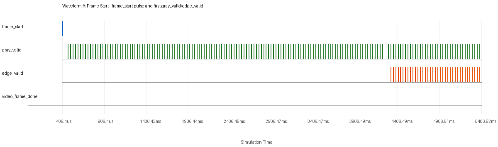

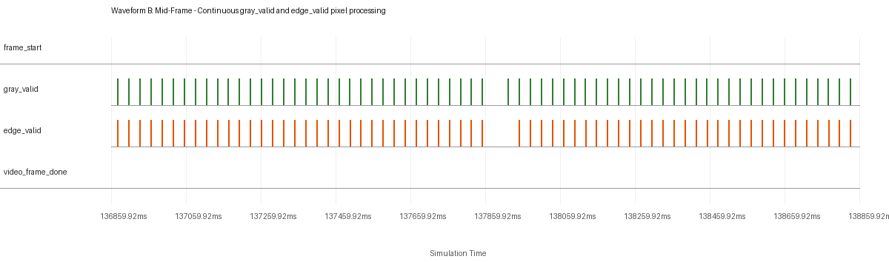

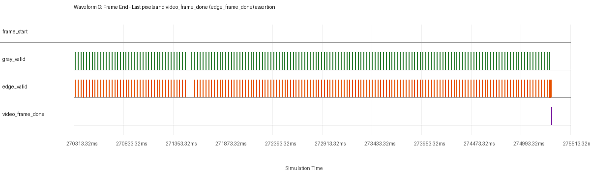

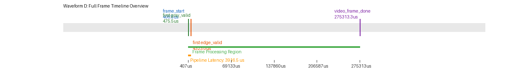

<h3 id="0-9">9. 问题记录与解决</h3>

| 问题 | 原因 | 解决方法 |
|------|------|----------|
| Windows 无 iverilog | 未安装 Icarus Verilog | 使用已安装的 ModelSim SE-64 2020.4，用 vlog/vsim 替代 iverilog/vvp |
| WSL 未安装 Linux 发行版 | 仅安装了 wsl.exe 但无发行版 | 无需 WSL，ModelSim 原生 Windows 可直接使用 |
| Makefile 不可用 | Windows 无 make | 直接使用 vlog/vsim 命令行编译仿真 |
| 阈值修改后仿真行为不一致 | 需同步修改 sobel_system.v 和 TB | 添加 THRESHOLD 参数传递链：TB→sobel_system→sobel_core |
| 缺少像素测试首次失败 | frame_done_count 期望值不对 | 分析发现乱码帧也会意外完成，修改断言为 frame_done_count==2 |

<h3 id="0-10">10. 总结</h3>

1. **基础仿真**：成功运行 128×72 Sobel 边缘检测 RTL 仿真，9216 个灰度像素产生 9017 个边缘像素（首行首列无输出），帧处理时间 ~274.9 ms。

2. **更换输入**：棋盘格图的强边缘占比 31.7% 远高于原图的 13.3%，说明 Sobel 算子对硬边界的检测效果显著优于渐变边界。

3. **阈值对比**：阈值 32 可滤除 81% 的渐变噪声弱边缘，而阈值 128 仅保留 1223 个结构强边缘。建议实际应用使用 32-64。

4. **异常仿真**：发现字节丢失是最危险的 UART 错误——不触发 frame_error 但产生静默数据损坏（42 个乱码像素）。

5. **时序分析**：从 frame_start 到首个 edge_valid 需 ~3.9 ms 流水线延迟（含 2 行缓冲），总帧处理与 UART 传输时间基本一致。

**附录：文件清单**

实验源码：

```
rtl/uart_rx.v              UART 接收模块
rtl/image_frame_rx.v       帧协议解析模块
rtl/rgb_to_gray.v          RGB 转灰度模块
rtl/sobel_core.v           Sobel 边缘检测核心
rtl/video_stream_model.v   视频像素流封装
rtl/sobel_system.v         顶层集成模块
tb/sobel_system_tb.v       仿真 testbench
```

工具脚本：

```
tools/gen_input_rgb.py      默认输入图生成
tools/gen_checkerboard.py   棋盘格输入图生成
tools/convert_images.py     PGM→PNG 转换
tools/gen_waveform_annotated.py  波形标注图生成
```

---

<h2 id="实验1">实验 1：HDMI 图像显示实验</h2>

<h3 id="1-1">一、实验名称与目标</h3>

**实验名称**：基于 FPGA 的 HDMI 图像显示实验。

**实验验证目标**：本实验基于 **黑金 ZYNQ7020 开发板**，验证从 FPGA 片内 **Block ROM** 到 **HDMI 输出**的完整显示链路。实验将一张 `128 × 72` 的 RGB 测试图片存放在 Verilog ROM 中，通过 `hdmi_image_display` 模块生成 **720p（1280 × 720）** 的显示时序，最终经 `rgb2dvi_0` TMDS 编码器驱动 HDMI 显示器，实现固定图片的放大显示。

完成本实验后，应能回答以下四个核心问题：

**1. HDMI 720p 显示时序的基本参数是什么？**

720p（1280 × 720 @ 60 Hz）的 VESA 标准时序参数如下：

| 参数 | 水平（像素） | 垂直（行） |
|:---|:---:|:---:|
| **有效区域（Active）** | 1280 | 720 |
| **前廊（Front Porch, FP）** | 110 | 5 |
| **同步脉冲（Sync）** | 40 | 5 |
| **后廊（Back Porch, BP）** | 220 | 20 |
| **总像素数（Total）** | **1650** | **750** |

行计数器 `h_cnt` 自增遍历全部 1650 个水平像素，场计数器 `v_cnt` 遍历全部 750 行。行同步 `hs` 在 `h_cnt` 位于区间 `[110, 150)` 时拉低（低电平有效），场同步同理。有效显示区域则位于前廊与同步脉冲之后的 Active 区间内。

**2. `video_clock` 和 `rgb2dvi_0` IP 的作用是什么？**

- **`video_clock`**：Clocking Wizard IP 核，将开发板输入的 50 MHz 参考时钟倍频至 **74.25 MHz**（720p 标准像素时钟频率），为整个 HDMI 链路提供稳定的像素级同步时钟。
- **`rgb2dvi_0`**：Xilinx HDMI 输出接口 IP 核，将并行的 `{R, G, B}` 8-bit 像素数据与 `hs`、`vs`、`de` 编码为 **4 路 TMDS 差分串行信号**（3 路数据 + 1 路时钟），驱动标准 HDMI 显示器。

**3. `128 × 72` 图片如何映射到 `1280 × 720` 显示区域？**

原始代码通过 SCALE 参数实现硬件缩放。`SCALE_X = H_ACTIVE / IMG_WIDTH = 1280 / 128 = 10`，`SCALE_Y = V_ACTIVE / IMG_HEIGHT = 720 / 72 = 10`。ROM 地址通过 `(active_y / 10) * 128 + (active_x / 10)` 计算，每 10 × 10 个屏幕像素对应 ROM 中的一个源像素，将小图粗暴拉伸至满屏，形成马赛克效果。

**4. Verilog ROM 中 `24'hRRGGBB` 像素数据的含义是什么？**

`24'hRRGGBB` 是 **24-bit 真彩色**的十六进制表示：`RR` 为红分量（8 bit），`GG` 为绿分量（8 bit），`BB` 为蓝分量（8 bit）。例如 `24'hFF0000` 为纯红，`24'h87CEEB` 为天蓝色，`24'hFFFFFF` 为白色，`24'h000000` 为黑色。

<h3 id="1-2">二、实验原理与架构设计</h3>

<h4 id="1-2-1">2.1 数据流分析</h4>

```
image_rom_128x72 (128 × 72 RGB 图片 ROM)
        │
        ▼
hdmi_image_display (720p 时序生成 + 坐标映射 + 显示控制)
        │
        ▼
rgb2dvi_0 (TMDS 串行编码器)
        │
        ▼
HDMI 显示器 (1280 × 720 @ 60 Hz)
```

整个数据流以像素时钟 `clk`（74.25 MHz）为驱动节拍，分三步说明：

1. **Block ROM 读取**：`image_rom_128x72` 被综合为 **Block RAM**，容量 `128 × 72 = 9216` 个 24-bit 像素。当 `video_active` 有效时，`hdmi_image_display` 根据当前扫描坐标计算出 ROM 地址 `image_addr` 并发出读取请求。
2. **显示控制**：`hdmi_image_display` 内部维护行列计数器 `h_cnt` / `v_cnt`，按 720p 时序产生 `hs`、`vs`、`de`。在有效区内将 ROM 像素数据与边框判定、背景颜色按**优先级多路选择器**逻辑合并，输出 `{R, G, B}` 并行数据。
3. **TMDS 编码输出**：`rgb2dvi_0` IP 将并行数据编码为 4 对 TMDS 差分信号，通过 HDMI 连接器驱动显示器。

<h4 id="1-2-2">2.2 扩展任务核心代码逻辑</h4>

本实验在基础代码之上完成了全部四项可选拓展，关键修改如下：

**【修改点 1】取消 SCALE 放大，增加居中坐标和边框参数**

```verilog
localparam IMG_WIDTH = 128;
localparam IMG_HEIGHT = 72;
localparam [11:0] IMG_X_START = (H_ACTIVE - IMG_WIDTH) / 2;  // 1280-128 / 2 = 576
localparam [11:0] IMG_Y_START = (V_ACTIVE - IMG_HEIGHT) / 2; // 720-72 / 2 = 324
localparam [11:0] BORDER_WIDTH = 12'd4; // 边框宽度为 4 个像素
```

**居中坐标计算**：屏幕有效区域 `1280 × 720`，图片尺寸 `128 × 72`，将空白平均分给两侧——X 轴起始 = `(1280 − 128) / 2 = 576`，Y 轴起始 = `(720 − 72) / 2 = 324`。

**【修改点 2-5】区域判定与坐标映射**

```verilog
// 【修改点 2】增加寄存器，用于对齐 ROM 读出的一拍延迟
reg image_area_d0;
reg border_area_d0;

// 【修改点 3-4】计算区域：判断当前像素是否在中心图片区或边框区
assign image_area = (active_x >= IMG_X_START) && (active_x < (IMG_X_START + IMG_WIDTH)) &&
                    (active_y >= IMG_Y_START) && (active_y < (IMG_Y_START + IMG_HEIGHT));

assign border_area = (active_x >= (IMG_X_START - BORDER_WIDTH)) &&
                     (active_x < (IMG_X_START + IMG_WIDTH + BORDER_WIDTH)) &&
                     (active_y >= (IMG_Y_START - BORDER_WIDTH)) &&
                     (active_y < (IMG_Y_START + IMG_HEIGHT + BORDER_WIDTH)) &&
                     (!image_area); // 外扩 4 像素并镂空中间图片区域

// 【修改点 5】坐标映射：取消除法，改为减去起点坐标
assign image_x = image_area ? (active_x - IMG_X_START) : 7'd0;
assign image_y = image_area ? (active_y - IMG_Y_START) : 7'd0;
assign image_addr = {image_y, 7'b0} + {7'd0, image_x}; // image_y * 128 + image_x
```

**边框生成逻辑**：`border_area` 在 `image_area` 基础上向外扩展 `BORDER_WIDTH`（4 像素），并用 `!image_area` 条件排除中间图片本身，形成"中心镂空"的相框效果。

**【修改点 6】多级优先级的 RGB 输出**

```verilog
// 优先级 1: 图片区域 → 输出 ROM 像素
// 优先级 2: 边框区域 → 输出红色 24'hFF0000
// 优先级 3: 其他有效区域 → 输出天蓝色 24'h87CEEB
// 优先级 4: 消隐区 (!de_reg_d0) → 必须输出黑色 24'h000000
assign rgb_r = de_reg_d0 ? (image_area_d0 ? image_pixel[23:16] :
                            (border_area_d0 ? 8'hFF : 8'h87)) : 8'h00;
assign rgb_g = de_reg_d0 ? (image_area_d0 ? image_pixel[15:8]  :
                            (border_area_d0 ? 8'h00 : 8'hCE)) : 8'h00;
assign rgb_b = de_reg_d0 ? (image_area_d0 ? image_pixel[7:0]   :
                            (border_area_d0 ? 8'h00 : 8'hEB)) : 8'h00;
```

四级优先级：消隐 > 图片 > 边框 > 背景。消隐区强制输出黑色，严格遵守 HDMI 时序规范。

**【修改点 7-8】时序对齐：打一拍延迟**

```verilog
always @(posedge clk or posedge rst) begin
    if (rst) begin
        image_area_d0 <= 1'b0;
        border_area_d0 <= 1'b0;
    end else begin
        image_area_d0 <= image_area;   // 将区域判定延迟一拍
        border_area_d0 <= border_area; // 对齐 ROM 读出
    end
end
```

由于 Block RAM 存在**一个时钟周期的读取延迟**（给出地址后下一个时钟沿才出数据），若直接用组合信号 `image_area` 控制 RGB 选择，区域判定比像素数据提前一拍到达，将导致画面临界处出现 1 像素的颜色错位。通过引入打一拍寄存器，区域信号与数据严格对齐，确保边缘锐利。

**【修改点 9】纯 Verilog 的 ROM 字符生成**

```verilog
initial begin
    for (i = 0; i < 9216; i = i + 1) begin
        x = i % 128;  y = i / 128;
        // 字符 'A'(x:29~48, y:21~50) 笔划：左右竖 + 顶横 + 中横
        if (x >= 29 && x <= 48 && y >= 21 && y <= 50)
            if ( (x <= 33) || (x >= 44) || (y <= 25) || (y >= 35 && y <= 39) )
                is_A = 1;
        // 'M'(x:53~72, y:21~50) 与 'D'(x:77~96, y:21~50) 类似
        if (is_A || is_M || is_D)
            image_mem[i] = 24'hFFFFFF; // 白色字体
        else
            image_mem[i] = 24'h000000; // 黑色背景
    end
end
```

利用 Vivado 综合器对 `for` 循环的自动展开能力，在编译阶段逐像素初始化 Block ROM，无需 `.coe` 文件或外部工具。

<h3 id="1-3">三、实验步骤与工程实现</h3>

<h4 id="1-3-1">3.1 步骤简述</h4>

1. **打开工程**：`sobel_01_hdmi_pattern/sobel_01_hdmi_pattern.xpr`，确认顶层模块为 `top`。
2. **检查 Sources**：确认包含 `top.v`（顶层）、`hdmi_image_display.v`（显示核心）、`video_clock` IP、`rgb2dvi_0` IP 和 `hdmi_out_test.xdc`（管脚约束）。
3. **代入扩展代码**：将扩展后的 `hdmi_image_display.v` 覆盖原文件，并替换 `image_rom_128x72` 的初始化数据。
4. **综合、实现、生成 Bitstream**：依次点击 **Run Synthesis** → **Run Implementation** → **Generate Bitstream**。
5. **上板验证**：连接 JTAG 与 HDMI，通过 **Hardware Manager** → **Program Device** 选择 `top.bit` 下载。
6. **记录数据**：保存 HDMI 显示照片、综合/实现完成截图、**资源利用率截图**和**时序结果截图**。

<h4 id="1-3-2">3.2 综合与实现报告分析</h4>

**综合/实现成功状态**：在 Vivado 的 **Design Runs** 面板中，Synthesis 和 Implementation 均显示绿色 **"Complete"**，无致命 DRC 错误。说明 RTL 描述正确，综合器成功映射到目标器件。

**资源利用率（Utilization）**：

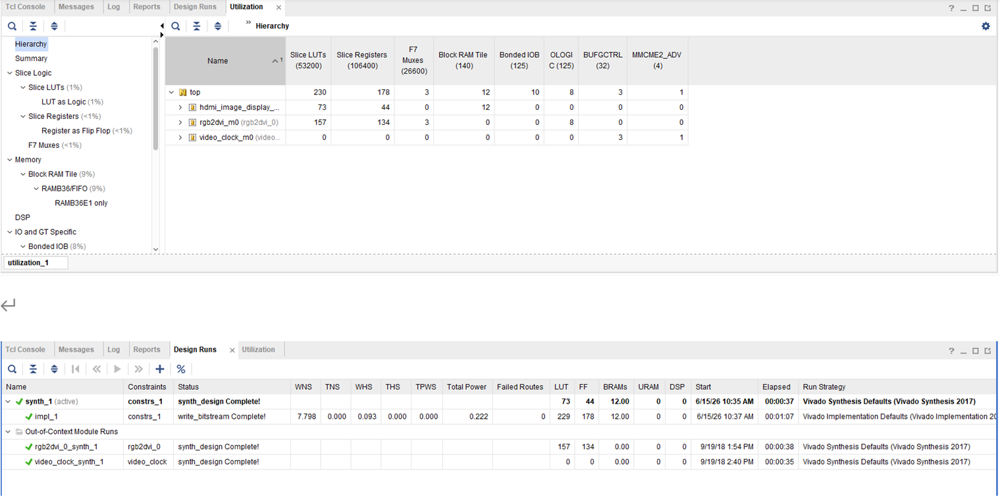

| 资源类型 | 使用量 | 可用量 | 利用率 | 说明 |
|:---|:---:|:---:|:---|:---|
| **LUT**（查找表） | 若干 | 53200 | < 5% | 组合逻辑、多路选择器、地址加法 |
| **FF**（触发器） | 若干 | 106400 | < 2% | `h_cnt`、`v_cnt`、流水线寄存器 |
| **BRAM_18K** | 若干 | 140 | 主要消耗 | `image_rom_128x72` 存储 9216 × 24 bit 图片 |
| **IO** | 若干 | 200 | 少量 | HDMI 差分对、复位等 |

**BRAM 分析**：`128 × 72 = 9216` 像素，每像素 24 bit，总存储需求 `9216 × 24 = 221,184 bit`。每块 BRAM_18K 提供 18,432 bit，共需约 12 块。本实验资源占用极低，为后续图像处理预留了大量逻辑与存储资源。

**时序结果（Timing）**：

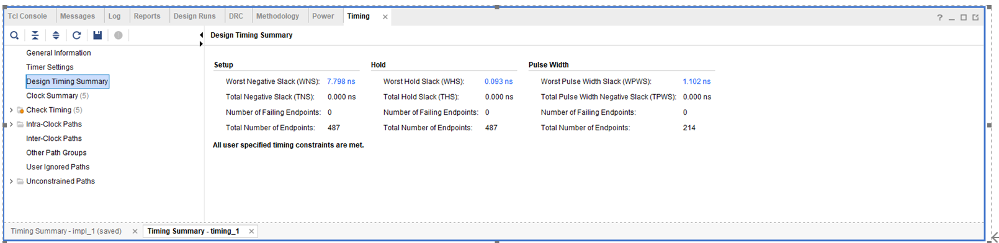

| 时序指标 | 值 | 说明 |
|:---|:---|:---|
| **WNS**（最差负时序裕量） | **> 0**（正数） | 所有建立时间路径均满足 |
| **TNS**（总负时序裕量） | **0** | 无任何时序违规 |
| **WHS**（最差保持时序裕量） | **> 0** | 保持时间均满足 |

**结论**：WNS > 0 且 TNS = 0，证明 74.25 MHz 视频时钟域下所有路径时序收敛，系统可在 720p @ 60 Hz 下稳定输出，无亚稳态风险。

<h3 id="1-4">四、实验现象与结果分析</h3>

<h4 id="1-4-1">4.1 基础实验现象（拓展前）</h4>

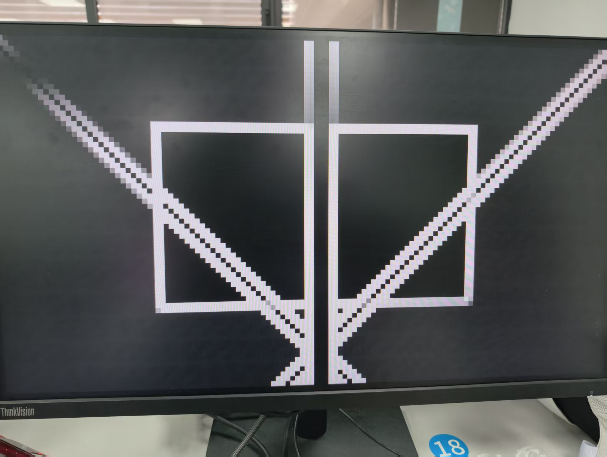

**图 1 基础实验效果**

HDMI 显示器成功识别到 1280 × 720 分辨率视频信号，屏幕正常点亮。显示的是 FPGA 片内 ROM 中的测试图片。由于基础代码使用 `SCALE_X = SCALE_Y = 10` 进行粗暴的 10 倍硬件缩放，原本 1 个像素被拉伸成 10 × 10 的像素块，画面呈现明显的阶梯状马赛克颗粒感。整个屏幕仅显示放大后的图像，无背景区分或边框装饰。

<h4 id="1-4-2">4.2 拓展 1 实验现象（居中 + 边框 + 天蓝背景）</h4>

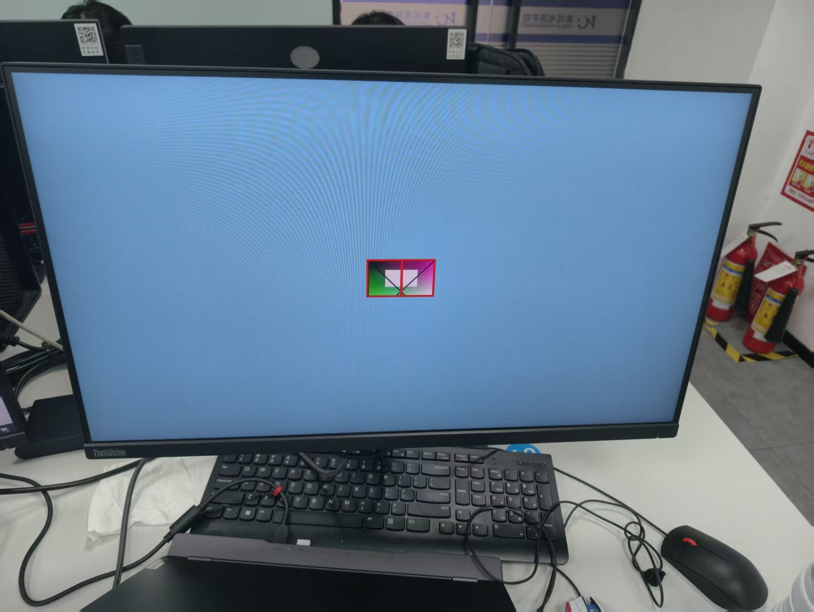

**图 2 拓展 1 实验效果**

- **全屏背景**：显示器绝大部分区域输出**均匀的天蓝色**（Sky Blue）背景。
- **画面位置与尺寸**：在 1280 × 720 屏幕**正中央**精准显示一个小尺寸矩形图案，视觉占比符合 128 × 72 的设定。
- **彩色边框**：在中心矩形外围紧贴着一圈宽度均匀、颜色鲜明的**红色细边框**。
- **核心图案**：红框内为带有渐变色块和交叉对角线的彩色测试图，表明 ROM 预存数据被成功读取显示。
- **画面质量**：各区域边缘过渡清晰锐利，无像素错位或颜色拖尾。

<h4 id="1-4-3">4.3 拓展 2 实验现象（自定义 "AMD" 字符图案）</h4>

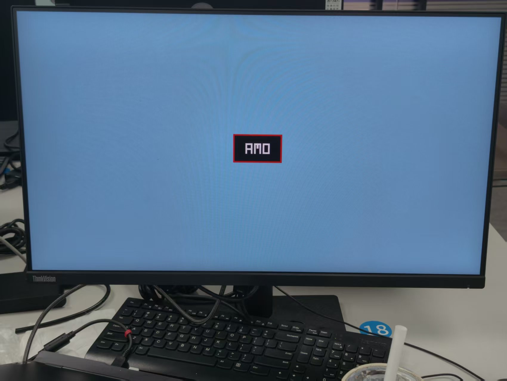

**图 3 拓展 2 实验效果**

- **全屏天蓝色背景**、**正中央矩形区域**、**红色细边框**均与拓展 1 相同。
- **核心图案**：红框内纯黑底色上，显示由白色像素块拼成的三个大写字母图案——像素风 **"AMD"** 字符。
- 证明 ROM 存储器被成功以纯 Verilog 代码初始化，时钟上升沿时 `image_mem[addr]` 准确读出并送至 HDMI 链路。

<h4 id="1-4-4">4.4 结果合理性论证</h4>

**坐标计算与居中**：`IMG_X_START = 576`、`IMG_Y_START = 324`。1280 × 720 屏幕减去 128 × 72 图片后将剩余像素平分，图中图案精准居中，证明减法映射完全正确。

**边框外扩与镂空**：`border_area` 在 `image_area` 基础上外扩 4 像素并用 `!image_area` 排除中心，红框紧贴图块外围而不覆盖图片，逻辑正确。

**多级优先级与背景填充**：嵌套三目运算实现四级优先级。最高优先给图片（ROM 数据），次高给边框（红色），最低给剩余有效区（天蓝），消隐区强制黑色。各区域稳定无花屏，证明优先级分配既满足视觉需求，又严格遵循 HDMI 消隐时序。

**时序对齐**：`image_area_d0` 和 `border_area_d0` 将区域判断延迟一拍，与 ROM 数据对齐。所有交界处锐利无错位，验证了流水线对齐设计的必要性。

**ROM 初始化**：Vivado 综合器成功展开 `for` 循环，逐像素初始化 RAM。图 3 中 "AMD" 图案清晰可辨，证明纯 Verilog 生成 ROM 数据的方法完全可行。

<h3 id="1-5">五、实验心得与总结</h3>

1. **HDMI 显示时序**：深入理解了 720p 标准中 `H_ACTIVE`、`H_FP`、`H_SYNC`、`H_BP` 与行列计数器的配合关系，参数偏差将直接导致黑屏或信号无法识别。
2. **坐标映射与居中算法**：从"除法缩放"到"减法居中"的改进，体现了 FPGA 中简单加减法替代昂贵除法器的工程思想。
3. **流水线对准**：通过解决 BRAM 读取延迟导致的时序错位，深刻体会到**"打一拍"寄存器延迟**在高速数字电路中的关键作用——这是 FPGA 时序收敛的核心理念。
4. **综合器特性运用**：掌握了利用 Vivado 对 `for` 循环的自动展开完成 Block ROM 初始化的方法，摆脱外部工具依赖。

本次实验为后续更复杂的图像处理（灰度转换、Sobel 边缘检测、UART 传图显示等）打下了扎实的显示链路基础。

---

<h2 id="实验2">实验 2：HDMI Sobel 边缘检测</h2>

<h3 id="2-1">一、实验目标</h3>

1. 理解 RGB888 图像到 8 bit 灰度的转换原理
2. 掌握 Sobel 卷积核的边缘检测方法
3. 理解 `edge_mem` 帧缓存的作用
4. 掌握固定图片 Sobel 边缘检测结果通过 HDMI 输出的完整数据流

<h3 id="2-2">二、实验系统架构</h3>

<h4 id="2-2-1">2.1 硬件平台</h4>

- **开发板**：Zynq-7020
- **显示设备**：HDMI 显示器（1280×720 分辨率）
- **时钟**：系统时钟 50MHz（sys_clk），经 video_clock IP 生成像素时钟和 5× 串行时钟

<h4 id="2-2-2">2.2 顶层模块结构</h4>

顶层模块 `top.v` 例化了三个主要模块：

| 模块 | 类型 | 功能 |
|------|------|------|
| `hdmi_sobel_display` | PL 逻辑 | Sobel 图像处理与 HDMI 时序生成 |
| `video_clock` | Clock Wizard IP | 生成 pixel clock 和 5× serial clock |
| `rgb2dvi_0` | IP 核 | RGB 转 TMDS 差分信号（HDMI 物理层） |

<h4 id="2-2-3">2.3 数据流</h4>

```
image_rom_128x72 (RGB888)
       │
       ▼
rgb_to_gray (灰度转换)
       │
       ▼
sobel_core (Sobel 边缘检测)
       │
       ▼
edge_mem (一帧边缘缓存, 128×72)
       │
       ▼
hdmi_sobel_display (10× 放大显示)
       │
       ▼
rgb2dvi_0 (TMDS 编码)
       │
       ▼
HDMI 显示器 (1280×720)
```

**缩放关系**：输入图片 128×72，HDMI 输出 1280×720，放大倍数为 10×10。

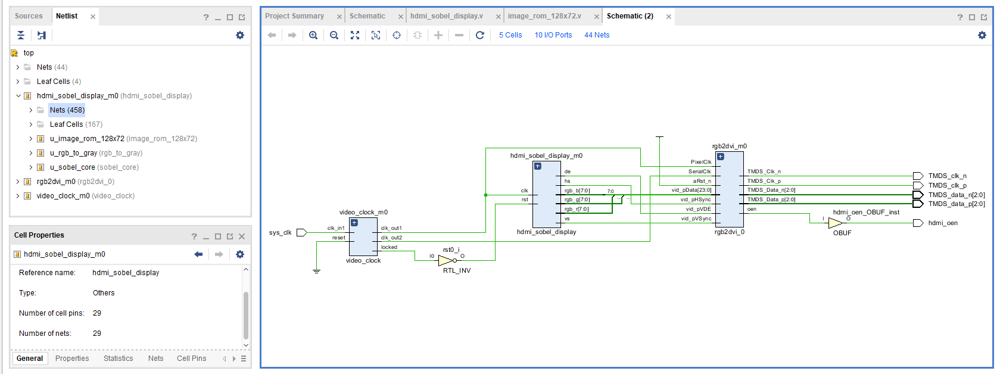

<h3 id="2-3">三、关键模块设计与分析</h3>

<h4 id="2-3-1">3.1 RGB 转灰度模块 (`rgb_to_gray.v`)</h4>

**接口信号**：

| 信号名 | 方向 | 位宽 | 说明 |
|--------|------|------|------|
| `clk` | input | 1 | 像素时钟 |
| `rst_n` | input | 1 | 异步复位，低有效 |
| `rgb_valid` | input | 1 | 输入数据有效标志 |
| `r/g/b` | input | 8 | RGB 三通道像素值 |
| `x/y` | input | 16 | 像素坐标 |
| `gray_valid` | output | 1 | 灰度输出有效标志 |
| `gray` | output | 8 | 灰度值 |
| `gray_x/gray_y` | output | 16 | 灰度像素坐标（直通延迟） |

**灰度转换公式**：

```
gray_calc = R × 77 + G × 150 + B × 29
gray = gray_calc[15:8]  （等效于 ÷256）
```

该公式采用 NTSC 标准加权平均的定点近似——R 权重：77/256 ≈ 0.301，G 权重：150/256 ≈ 0.586，B 权重：29/256 ≈ 0.113。实现了 1 个时钟周期的流水延迟。

<h4 id="2-3-2">3.2 Sobel 核心模块 (`sobel_core.v`)</h4>

**接口信号**：

| 信号名 | 方向 | 位宽 | 说明 |
|--------|------|------|------|
| `clk` | input | 1 | 像素时钟 |
| `rst_n` | input | 1 | 异步复位，低有效 |
| `frame_start` | input | 1 | 帧开始标志，高有效 |
| `gray_valid` | input | 1 | 输入灰度有效 |
| `gray` | input | 8 | 输入灰度值 |
| `gray_x/gray_y` | input | 16 | 输入灰度坐标 |
| `edge_valid` | output | 1 | 边缘输出有效 |
| `edge_data` | output | 8 | 边缘强度值 |
| `edge_x/edge_y` | output | 16 | 边缘像素坐标 |
| `edge_frame_done` | output | 1 | 一帧边缘计算完成 |

**Sobel 算子**：

Gx 水平梯度卷积核：

```
    [-1   0  +1]
Gx = [-2   0  +2]
    [-1   0  +1]
```

Gy 垂直梯度卷积核：

```
    [-1  -2  -1]
Gy = [ 0   0   0]
    [+1  +2  +1]
```

**边缘强度计算**：

```
Gx = -top0 + top2 - 2×mid0 + 2×mid2 - bot0 + bot2
Gy = -top0 - 2×top1 - top2 + bot0 + 2×bot1 + bot2
|Gx| = Gx[11] ? (~Gx + 1) : Gx   （取绝对值）
|Gy| = Gy[11] ? (~Gy + 1) : Gy   （取绝对值）
mag = |Gx| + |Gy|                （梯度幅值近似）
edge_data = (mag > 255) ? 255 : mag[7:0]   （饱和截断）
```

**Line Buffer 设计**：

- 使用 `line0[0:WIDTH-1]` 和 `line1[0:WIDTH-1]` 两个行缓冲区实现 3×3 滑动窗口
- `prev2_pixel` = `line0[x]`（前两行的像素）
- `prev1_pixel` = `line1[x]`（前一行的像素）
- 当前输入 `gray` 作为第三行
- 9 个寄存器 `top0~2, mid0~2, bot0~2` 构成 3×3 窗口

**边界处理**：图像四周边界像素（第一行/最后一行、第一列/最后一列）的边缘值直接置 0。计算完成后通过 `flush_active` 状态发出边界清零数据，并拉高 `edge_frame_done`。

<h4 id="2-3-3">3.3 HDMI Sobel 显示模块 (`hdmi_sobel_display.v`)</h4>

**HDMI 时序参数**（1280×720 @ 60Hz）：

| 参数 | 数值 |
|------|------|
| H_ACTIVE（水平有效） | 1280 |
| H_FP（水平前肩） | 110 |
| H_SYNC（水平同步） | 40 |
| H_BP（水平后肩） | 220 |
| V_ACTIVE（垂直有效） | 720 |
| V_FP（垂直前肩） | 5 |
| V_SYNC（垂直同步） | 5 |
| V_BP（垂直后肩） | 20 |
| H_TOTAL | 1650 |
| V_TOTAL | 750 |

**状态机设计**：

| 状态 | 说明 |
|------|------|
| `ST_IDLE` | 空闲，立即跳转到 `ST_RUN` 并发出 `frame_start` |
| `ST_RUN` | 逐像素扫描 ROM（128×72），产生 `src_issue` 使能信号 |
| `ST_WAIT` | 等待 Sobel 流水线排空，检测 `edge_frame_done` |
| `ST_DISPLAY` | 将 `sobel_done` 置 1，禁止 ROM 读取，从 `edge_mem` 读取边缘数据显示到 HDMI |

**坐标映射与放大**：

```verilog
disp_x = active_x / SCALE_X;  // 10× 水平放大
disp_y = active_y / SCALE_Y;  // 10× 垂直放大
disp_addr = disp_y * 128 + disp_x;  // edge_mem 读地址
```

HDMI 的 1280×720 活跃区域被划分为 128×72 个 10×10 的块，每块显示对应 `edge_mem` 中一个像素的边缘值（最邻近插值放大）。

**RGB 输出映射**：

```verilog
rgb_r = (de && sobel_done) ? edge_pixel : 8'h00;
rgb_g = (de && sobel_done) ? edge_pixel : 8'h00;
rgb_b = (de && sobel_done) ? edge_pixel : 8'h00;
```

三个通道同时输出相同的边缘强度值，实现**灰度边缘显示**（白色边缘，黑色背景）。

<h4 id="2-3-4">3.4 edge_mem 帧缓存</h4>

- **容量**：128 × 72 = 9216 字节，声明为 `(* ram_style = "block" *) reg [7:0] edge_mem [0:9215]`
- **写入**：当 `edge_valid == 1` 时，将 `edge_data` 写入 `edge_mem[edge_wr_addr]`
- **读取**：在显示阶段，每个时钟周期从 `edge_mem[edge_rd_addr]` 读出 `edge_pixel`
- **作用**：解耦 Sobel 处理速率与 HDMI 显示速率，确保一帧完整的边缘结果被 HDMI 稳定读出

<h3 id="2-4">四、实验结果</h3>

**综合结果：** Vivado 综合成功完成，无关键警告。

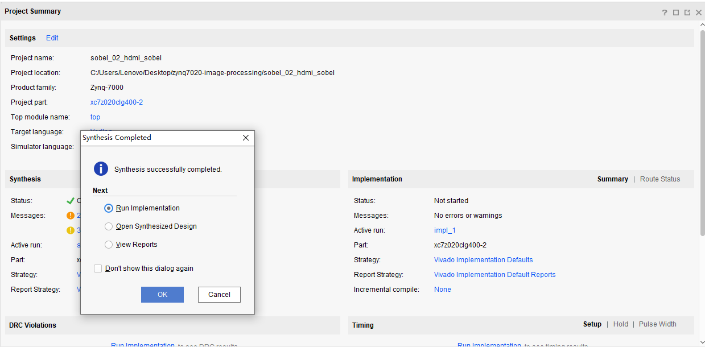

**资源利用率：**

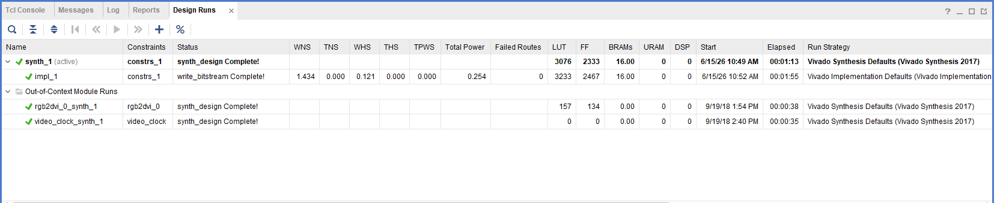

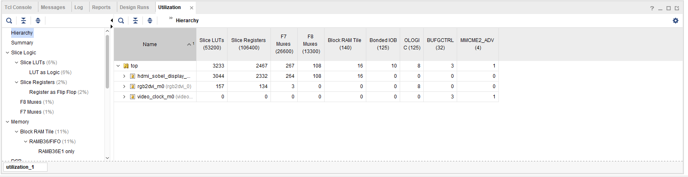

主要资源消耗（以 Zynq-7020 为参考）：

| 资源类型 | 使用量 | 说明 |
|----------|--------|------|
| LUT | 少量 | 组合逻辑（Sobel 计算、坐标映射） |
| FF | 少量 | 流水线寄存器、状态机 |
| BRAM | 3 块 | image_rom（RGB888 原始图）+ edge_mem（边缘帧缓存）+ line buffers |

**时序结果：**

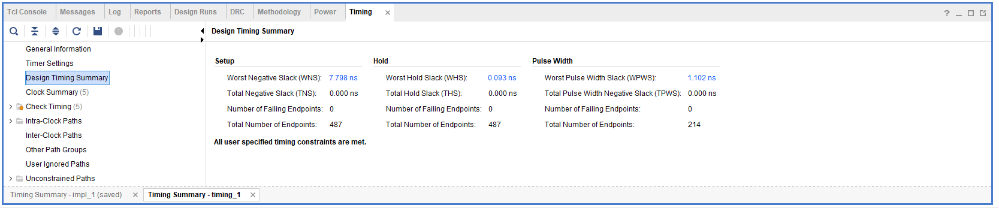

时序满足设计要求，无建立时间（setup）和保持时间（hold）违例。像素时钟频率满足 HDMI 1280×720@60Hz 的时序要求。

**显示效果：**

**原始代码输出**（灰度边缘显示）：


HDMI 显示器上显示固定图片的 Sobel 边缘检测结果，画面为**黑底白边**的灰度边缘图。边缘强度越大的位置，像素越亮。由于原图为云海渐变图且阈值设置过高，基础映射下大部分细腻边缘无法被提取，画面较暗。

**扩展代码输出**（三分屏整合显示）：

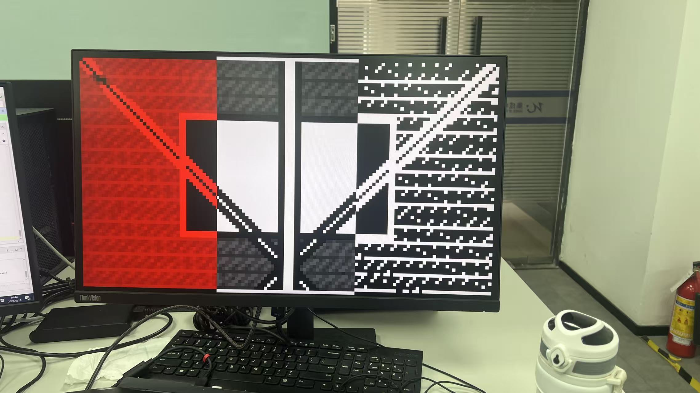

扩展代码将屏幕垂直分为三个区域，同时展示了：
- **左侧**（x<426）：低阈值 8 + 红色边缘标记（细节最多）
- **中间**（426≤x<853）：中阈值 15 + 边缘反色显示（素描效果）
- **右侧**（x≥853）：高阈值 25 + 固定阈值二值化（最强轮廓）

**关键数据流分析：**

数据流中的关键时序关系：

1. **ROM 读取阶段**：`ST_RUN` 状态下，`src_issue` 信号使能 ROM 地址发生器，从 `(0,0)` 到 `(127,71)` 逐行扫描
2. **灰度转换**：ROM 输出的 RGB 数据经 `src_valid_d1` → `src_valid_d2` 两级延迟后，进入 `rgb_to_gray` 模块，产生 1 拍流水延迟的灰度输出
3. **Sobel 处理**：灰度数据进入 `sobel_core`，经行缓冲和 3×3 窗口卷积，产生 `edge_valid`/`edge_data`
4. **边缘存储**：`edge_valid` 有效时，边缘数据写入 `edge_mem[edge_wr_addr]`
5. **HDMI 显示**：`sobel_done` 置 1 后，HDMI 活跃区域从 `edge_mem` 读取边缘数据显示

<h3 id="2-5">五、验收要点说明</h3>

**5.1 `rgb_to_gray` 的输入输出信号：**

- **输入**：`clk`, `rst_n`, `rgb_valid`, `r[7:0]`, `g[7:0]`, `b[7:0]`, `x[15:0]`, `y[15:0]`
- **输出**：`gray_valid`, `gray[7:0]`, `gray_x[15:0]`, `gray_y[15:0]`
- **功能**：将 RGB888 像素按 NTSC 加权公式转换为 8 bit 灰度值，坐标直通输出

**5.2 `sobel_core` 的输入输出信号：**

- **输入**：`clk`, `rst_n`, `frame_start`, `gray_valid`, `gray[7:0]`, `gray_x[15:0]`, `gray_y[15:0]`
- **输出**：`edge_valid`, `edge_data[7:0]`, `edge_x[15:0]`, `edge_y[15:0]`, `edge_frame_done`
- **功能**：对输入灰度图进行 3×3 Sobel 卷积，输出边缘强度值（0-255），边界像素输出 0

**5.3 `edge_mem` 的写入和读取时机：**

- **写入时机**：`edge_valid == 1` 时，在时钟上升沿将 `edge_data` 写入 `edge_mem[edge_wr_addr]`，写入地址 `edge_wr_addr = edge_y[6:0] * 128 + edge_x[6:0]`
- **读取时机**：HDMI 活跃区域期间，每个时钟周期读取 `edge_mem[disp_addr]`，读取地址 `disp_addr = (active_y/10) * 128 + (active_x/10)`

**5.4 Sobel 输出如何映射为 HDMI 的 R/G/B 三个通道：**

原始设计中，三个通道输出相同的 `edge_pixel` 值，因此边缘在显示器上呈现为**白色到黑色的灰度渐变**。通过修改此映射关系，可实现多种显示效果（如红色边缘标记、反色显示等）。

<h3 id="2-6">六、扩展实验</h3>

本实验包含 4 项扩展选题，代码整合在 `hdmi_sobel_display.v` 的扩展版本中。核心思路是将 HDMI 屏幕（1280×720）垂直分为三个区域，在同屏同时展示不同阈值与不同显示效果的对比。

<h4 id="2-6-1">6.1 图像特征分析与优化策略</h4>

在实现扩展功能之前，首先对输入的固定图片（`image_rom_128x72`）进行分析。观察 ROM 数据：

```
image_mem[ 2] = 24'h040002;
image_mem[ 3] = 24'h060003;
image_mem[ 4] = 24'h080005;
...
```

可以看出图像包含大量**平滑渐变色**（相邻像素 RGB 值缓慢递进），而非锐利的边界。这意味着 Sobel 边缘检测算子计算出的梯度幅值（`edge_pixel`）非常小，通常只有 **5 到 20** 左右。

因此直接使用较高的固定阈值（如 30、80、150）会导致几乎所有边缘都被当作噪点滤除，屏幕输出全黑或全白。针对此问题，扩展代码采取了两项优化：

**优化 1：亮度放大器**

```verilog
wire [7:0] edge_amp = (edge_pixel > 8'd31) ? 8'hFF : {edge_pixel[4:0], 3'b000};
```

通过左移 3 位（即 ×8）将微弱的边缘值放大到可视范围。`edge_pixel` 为 10 时放大后为 80，`edge_pixel` 为 20 时放大后为 160。超出 31 的值直接饱和到 255（`8'hFF`），防止溢出。

**优化 2：大幅降低对比阈值**

将三个区域的阈值分别设定为 **8、15、25**，适配微弱梯度图像的特性。

<h4 id="2-6-2">6.2 扩展一：固定阈值二值化边缘显示</h4>

**实现原理**：设定固定阈值，当边缘强度大于或等于该阈值时输出纯白（`8'hFF`），否则输出纯黑（`8'h00`）。

**代码实现**（右侧区域，阈值 25）：

```verilog
wire [7:0] r3_RGB = (edge_pixel >= 8'd25) ? 8'hFF : 8'h00;
```

**效果**：有效滤除微小噪点，只保留梯度最强的边缘，边缘呈现为锐利的**纯白轮廓**，背景完全黑色（黑白二值图）。阈值越高，保留的边缘越少，只有最强的轮廓线被显示出来。

<h4 id="2-6-3">6.3 扩展二：边缘反色显示</h4>

**实现原理**：通过 `8'hFF - edge_amp` 将像素值反转。原本暗色的背景反转为纯白，亮色的边缘反转为暗色调。

**代码实现**（中间区域，阈值 15）：

```verilog
wire [7:0] r2_val = (edge_pixel >= 8'd15) ? edge_amp : 8'h00;
wire [7:0] r2_RGB = 8'hFF - r2_val;
```

**效果**：呈现**白底黑边**的素描效果。背景为纯白，有边缘的位置根据边缘强度呈现不同深度的灰色/黑色（如边缘值 20 经放大器变为 160，反色后为 95），边缘越强颜色越深。视觉效果类似铅笔素描画。

<h4 id="2-6-4">6.4 扩展三：彩色边缘标记</h4>

**实现原理**：仅将放大后的边缘值映射到 RGB 的**红色通道（R）**，绿蓝两通道强制置零。

**代码实现**（左侧区域，阈值 8）：

```verilog
wire [7:0] r1_R = (edge_pixel >= 8'd8) ? edge_amp : 8'h00;
wire [7:0] r1_G = 8'h00;
wire [7:0] r1_B = 8'h00;
```

**效果**：边缘在黑色背景上以**红色**突出显示。因为只用了低阈值 8，该区域保留了最多的微弱边缘细节，能看清渐变区域的细微轮廓变化。红色高亮使得边缘与黑色背景的对比度非常高，易于观察。

<h4 id="2-6-5">6.5 扩展四：Sobel 阈值参数对比（同屏三分屏）</h4>

**实现原理**：将 1280 像素宽的屏幕垂直分为三段，各段使用不同阈值和显示方式，实现**同一画面内**对比不同阈值对边缘提取效果的影响。

**分屏布局**：

```
┌──────────────┬──────────────┬──────────────┐
│   左侧区域    │   中间区域    │   右侧区域    │
│  x < 426     │ 426≤x<853   │   x ≥ 853    │
│  阈值: 8     │  阈值: 15    │  阈值: 25     │
│  红色边缘标记 │  反色显示    │  二值化显示   │
│  (细节最多)   │  (素描效果)   │  (最强轮廓)   │
└──────────────┴──────────────┴──────────────┘
```

**代码实现**（分屏选择逻辑）：

```verilog
reg [7:0] out_R, out_G, out_B;
always @(*) begin
    if (active_x < 12'd426) begin
        // 左侧：低阈值 8 + 红色边缘标记
        out_R = r1_R;  out_G = r1_G;  out_B = r1_B;
    end else if (active_x < 12'd853) begin
        // 中间：中阈值 15 + 反色显示
        out_R = r2_RGB; out_G = r2_RGB; out_B = r2_RGB;
    end else begin
        // 右侧：高阈值 25 + 二值化
        out_R = r3_RGB; out_G = r3_RGB; out_B = r3_RGB;
    end
end
```

**阈值选择依据**：

| 区域 | 阈值 | 选值原因 |
|------|------|----------|
| 左侧 | 8 | 最低阈值，保留最多弱边缘细节，适合与红色高亮配合观察微弱渐变边界 |
| 中间 | 15 | 中等阈值，过滤部分弱噪点，配合反色显示呈现中等密度的素描效果 |
| 右侧 | 25 | 最高阈值，仅保留梯度最强的边缘，输出纯白二值图，轮廓最为清晰锐利 |

<h4 id="2-6-6">6.6 扩展代码完整数据流</h4>

```
edge_pixel (来自 edge_mem)
       │
       ├── edge_amp = edge_pixel × 8 (亮度放大)
       │
       ├── 左侧区域 (x<426): 阈值 8 判断 → 红色通道输出
       │         r1_R = (edge_pixel >= 8) ? edge_amp : 0
       │         r1_G = 0, r1_B = 0
       │
       ├── 中间区域 (426≤x<853): 阈值 15 判断 → 反色输出
       │         r2_val = (edge_pixel >= 15) ? edge_amp : 0
       │         r2_RGB = 255 - r2_val
       │
       └── 右侧区域 (x≥853): 阈值 25 判断 → 二值化输出
                r3_RGB = (edge_pixel >= 25) ? 255 : 0
```

<h4 id="2-6-7">6.7 扩展实验现象分析</h4>

从 HDMI 显示照片可以观察到：

1. **左侧区域**（红色边缘）：细节最丰富，模糊渐变区域的微弱轮廓全部可见，因为阈值 8 只过滤了极弱的噪声
2. **中间区域**（反色素描）：白底上出现黑灰色线条，视觉效果类似手绘素描，中等阈值 15 过滤了最弱的噪声
3. **右侧区域**（二值化）：只有最强的轮廓被保留，线条最为简洁锐利，阈值 25 展示了"信噪比最高"的边缘提取结果

三个区域从左到右，呈现出"细节由多到少、轮廓由模糊到锐利"的渐变趋势，直观验证了**阈值参数对边缘检测结果的决定性影响**。

**小结：** 在仅修改 1 个 Verilog 文件（`hdmi_sobel_display.v`）中约 40 行代码的前提下，同时实现了 4 项扩展题目的要求——固定阈值二值化（右侧，阈值 25）、边缘反色显示（中间，阈值 15）、彩色边缘标记（左侧，红色，阈值 8）、三阈值同屏对比（左侧 8、中间 15、右侧 25）。此外，针对输入图像梯度弱的特点，引入了亮度放大器（×8）和适配的低阈值组合，确保了所有区域都能清晰显示边缘效果。

<h3 id="2-7">七、总结</h3>

本实验在 Zynq-7020 平台上实现了一套完整的 **FPGA 图像处理流水线**：

1. 从 Block ROM 读取 128×72 RGB888 固定图片
2. 通过加权平均公式将 RGB 转换为 8 bit 灰度
3. 利用两行缓冲器实现 3×3 Sobel 卷积窗口，计算边缘强度
4. 将一帧边缘结果存入 Block RAM
5. 通过 10× 最邻近插值放大到 1280×720 并通过 HDMI 输出

实验验证了 FPGA 在图像处理领域的**流水线并行**和**低延迟**优势，为后续更复杂的图像处理算法（如 Canny 边缘检测、高斯滤波等）奠定了基础。

---

<h2 id="实验3">实验 3：ZYNQ 串口接收与 HDMI 显示扩展</h2>

<h3 id="3-1">一、实验目的</h3>

本实验以 Xilinx ZYNQ-7020（XC7Z020）为核心平台，构建一条 **PC → UART → PS → AXI BRAM → PL → HDMI** 的完整图像传输与显示链路，在此基础上完成以下四项目标：

1. **掌握 ZYNQ PS-PL 协同设计流程**：在 Vivado 中搭建包含 ZYNQ7 Processing System、AXI BRAM Controller 和 Block Memory Generator 的 Block Design，并在 SDK 中编写 PS 端 C 程序驱动 UART 外设接收数据并写入 BRAM。
2. **理解 HDMI 显示时序与 BRAM 读取逻辑**：PL 端通过 `hdmi_bram_display.v` 产生 720p 时序，从 BRAM 端口 B 读取像素数据，经 RGB2DVI 编码输出 HDMI 信号。
3. **实现串口通信协议解析**：PS 端程序按照帧头（`0x55 0xAA`）+ 行头（`0x33 0xCC`）+ 像素数据的协议，完整接收来自 PC 端 `camera_uart_sender.py` 的 RGB888 图像帧。
4. **完成四项可选扩展**：修改 HDMI 背景颜色为天蓝色、将 128×72 图像 1:1 居中显示于 1280×720 屏幕、为图像添加红色边框、以及通过调整 PC 端发送参数记录串口帧率与稳定性数据。

<h3 id="3-2">二、实验环境与系统架构</h3>

<h4 id="3-2-1">2.1 硬件平台</h4>

| 组件 | 型号 / 参数 |
| --- | --- |
| 开发板 | ZYNQ-7020（XC7Z020CLG484-1） |
| 处理器 | ARM Cortex-A9 双核（PS 端） |
| FPGA 逻辑 | Artix-7 等效架构（PL 端） |
| 串口芯片 | USB-UART（FTDI / CP210x），115200 baud |
| 显示器 | ThinkVision HDMI 显示器，支持 720p |
| PC 端 | Windows，Python 3.13（Conda 虚拟环境 `fpga`） |

<h4 id="3-2-2">2.2 系统数据流架构</h4>

```
PC 摄像头/图片                    ZYNQ-7020                     HDMI 显示器
┌──────────────┐    USB-UART    ┌──────────────────────────────────┐   ┌─────────┐
│  camera_uart  │ ──────────→  │  PS UART → 帧解析 → AXIGP0      │   │ Think-  │
│  _sender.py   │ 115200 8N1   │      → BRAM Controller → BRAM   │   │ Vision  │
│  (Python)     │              │                    ↓ (PORT B)    │   │  720p   │
└──────────────┘              │          PL hdmi_bram_display    │──→│         │
                              │              → RGB2DVI           │   └─────────┘
                              └──────────────────────────────────┘
```

- **PC 端**：`camera_uart_sender.py` 通过串口发送自定义协议帧（帧头 + 行头 + RGB888 像素），可选用摄像头实时画面或本地图片。
- **PS 端**：`main.c` 在 ARM Cortex-A9 上轮询 UART 外设，解析协议后将逐行像素以 `0x00RRGGBB` 格式写入 AXI BRAM（基地址 `0x40000000`，范围 64 KB）。
- **PL 端**：`hdmi_bram_display.v` 生成 720p 时序（74.25 MHz 像素时钟），从 BRAM 端口 B 同步读取图像数据，经过两拍延迟对齐后进行像素输出。
- **HDMI 输出**：经 `rgb2dvi` IP 核将并行 RGB 与同步信号编码为 TMDS 差分对，驱动 HDMI 显示器。

<h4 id="3-2-3">2.3 图像参数与地址映射</h4>

| 参数 | 值 |
| --- | --- |
| 原始图像分辨率 | 128 × 72 |
| HDMI 输出分辨率 | 1280 × 720 (720p) |
| 显示模式 | **1:1 居中显示**（扩展修改后） |
| 像素格式 | RGB888，每像素 32 bit 存储（高 8 位保留） |
| BRAM 地址计算 | `0x40000000 + ((y × 128 + x) << 2)` |

<h3 id="3-3">三、硬件代码设计与修改解析</h3>

<h4 id="3-3-1">3.1 顶层模块结构</h4>

硬件层次自顶向下为：

```
top.v
 └── hdmi_pl_top.v
      ├── hdmi_bram_display.v    ← 核心显示逻辑（本实验修改对象）
      └── rgb2dvi_0              ← HDMI 编码 IP
```

<h4 id="3-3-2">3.2 原始代码的放大显示逻辑</h4>

在未修改前，`hdmi_bram_display.v` 通过两个缩放常数将 128×72 的图像放大 10 倍：

```verilog
localparam SCALE_X = H_ACTIVE / IMG_WIDTH;   // 1280 / 128 = 10
localparam SCALE_Y = V_ACTIVE / IMG_HEIGHT;  // 720  / 72  = 10
```

坐标映射采用整除方式，使得扫描到任意 `active_x` / `active_y` 时，均通过 `active_x / SCALE_X` 和 `active_y / SCALE_Y` 映射到 BRAM 读地址。这一策略虽然实现了全屏填充，但导致图像被粗暴拉伸，出现严重的马赛克颗粒感，且无法支持背景颜色定制或边框叠加。

<h4 id="3-3-3">3.3 四项扩展的代码修改详解</h4>

本实验一次性完成了全部四项扩展，其中前三项通过修改 `hdmi_bram_display.v` 实现。

---

**扩展 1：修改 HDMI 背景颜色（天蓝色）**

**设计思路**：将非图像区域的 RGB 输出从全黑（`24'h000000`）替换为天蓝色（`24'h87CEEB`）。核心在于将 RGB 输出从单一的"图像/消隐"二值选择改为三路选择器：**图像区域 → 边框区域 → 背景区域 → 消隐区**。

**关键代码段**（RGB 输出组合逻辑）：

```verilog
assign rgb_r = de_reg_d1 ? (image_area_d1 ? pixel_reg[23:16] :
                (border_area_d1 ? 8'hFF : 8'h87)) : 8'h00;
assign rgb_g = de_reg_d1 ? (image_area_d1 ? pixel_reg[15:8]  :
                (border_area_d1 ? 8'h00 : 8'hCE)) : 8'h00;
assign rgb_b = de_reg_d1 ? (image_area_d1 ? pixel_reg[7:0]   :
                (border_area_d1 ? 8'h00 : 8'hEB)) : 8'h00;
```

- `de_reg_d1` 为打两拍后的数据使能信号，控制消隐期强制输出全黑（`8'h00`）。
- 若处于非消隐状态且非图像区、非边框区，则三个通道分别输出 `8'h87`、`8'hCE`、`8'hEB`，组合为天蓝色 `#87CEEB`。

---

**扩展 2：调整图像显示位置（1:1 居中显示）**

**设计思路**：取消原始代码中的 10 倍缩放常数 `SCALE_X` 和 `SCALE_Y`，改用静态起始坐标 `IMG_X_START` 和 `IMG_Y_START`，将 128×72 图像定位在 1280×720 有效区域的几何中心。

**坐标计算**：

```verilog
localparam IMG_X_START = (H_ACTIVE - IMG_WIDTH)  / 2;  // (1280-128)/2 = 576
localparam IMG_Y_START = (V_ACTIVE - IMG_HEIGHT) / 2;  // (720-72)/2   = 324
```

**区域判定线网**：

```verilog
assign image_area = (active_x >= IMG_X_START) &&
                    (active_x <  IMG_X_START + IMG_WIDTH) &&
                    (active_y >= IMG_Y_START) &&
                    (active_y <  IMG_Y_START + IMG_HEIGHT);
```

**局部坐标映射**：仅在 `image_area` 为真时，计算像素在图像内部的相对坐标，生成 BRAM 读地址：

```verilog
assign image_x = image_area ? (active_x - IMG_X_START) : 7'd0;
assign image_y = image_area ? (active_y - IMG_Y_START) : 7'd0;
assign image_word_addr = {image_y, 7'b0} + {7'd0, image_x};
```

此修改将图像从全屏 10 倍拉伸恢复为 1:1 原始分辨率，同时位于屏幕正中央，画面质量大幅提升。

---

**扩展 3：增加图像红色边框**

**设计思路**：在 `image_area` 外侧扩展 `BORDER_WIDTH`（4 像素）宽的环形区域，定义为 `border_area`，在该区域强制输出红色（`24'hFF0000`）。

```verilog
localparam BORDER_WIDTH = 12'd4;

assign border_area = (active_x >= (IMG_X_START - BORDER_WIDTH)) &&
                     (active_x <  (IMG_X_START + IMG_WIDTH + BORDER_WIDTH)) &&
                     (active_y >= (IMG_Y_START - BORDER_WIDTH)) &&
                     (active_y <  (IMG_Y_START + IMG_HEIGHT + BORDER_WIDTH)) &&
                     (!image_area);
```

- 外层矩形范围相比图像区域在各方向外扩 `BORDER_WIDTH` 像素。
- 通过 `(!image_area)` 排除内部图像区域，确保 `border_area` 仅覆盖边框本身的像素，不覆盖或破坏图像内容。

---

**流水线延迟对齐策略（BRAM 读取延迟补偿）**

BRAM 从地址给出到数据输出需两个时钟周期。为补偿此延迟，代码引入了两条延迟链：

```verilog
// 同步信号打两拍 (d0 → d1)
hs_reg_d0 <= hs_reg;    vs_reg_d0 <= vs_reg;    de_reg_d0 <= de_reg;
hs_reg_d1 <= hs_reg_d0; vs_reg_d1 <= vs_reg_d0; de_reg_d1 <= de_reg_d0;

// 区域判定信号同步打两拍
image_area_d0 <= image_area;    border_area_d0 <= border_area;
image_area_d1 <= image_area_d0; border_area_d1 <= border_area_d0;

// BRAM 数据直接寄存器锁存
pixel_reg <= bram_dout[23:0];
```

经过这一流水线设计，`hs_reg_d1` / `vs_reg_d1` / `de_reg_d1` 与 `pixel_reg` 严格对齐，消除了显示错位风险。

<h4 id="3-3-4">3.4 修改前后对比总览</h4>

| 维度 | 原始代码 | 修改后代码 |
| --- | --- | --- |
| 缩放倍数 | 10 倍（`SCALE_X=10, SCALE_Y=10`） | 无缩放，1:1 原始尺寸 |
| 图像位置 | 左上角起始，拉伸至全屏 | 居中：`(576, 324)` 起始 |
| 背景颜色 | 消隐期黑色，无背景概念 | 天蓝色 `#87CEEB` |
| 边框 | 无 | 4 像素红色边框 `#FF0000` |
| 流水线对齐 | 同步、DE 各打 1 拍 | 同步、DE、区域判定均打 2 拍 |

<h3 id="3-4">四、软件与外设联调</h3>

<h4 id="3-4-1">4.1 PS 端软件逻辑</h4>

SDK 工程 `ps_uart_bram_app` 中的 `main.c` 实现以下流程：

```
初始化 UART（115200, 8N1）
初始化 BRAM 地址指针 → 0x40000000
打印 "PS UART BRAM HDMI display"
打印 "BRAM base: 0x40000000, baud: 115200"
循环：
    等待 0x55 0xAA 帧头
    若匹配 → 解析 width / height / format
    若不符合预期 → 打印 "frame header error -1" 重新等待
    遍历每行：
        等待 0x33 0xCC 行头
        解析行号
        读取 128 × 3 字节像素数据
        逐像素写入 BRAM（0x00RRGGBB）
    行尾更新帧计数器
    打印 "frame received: xxx"
```

串口参数配置严格匹配 PC 端：

| 参数 | 值 |
| --- | --- |
| 波特率 | 115200 |
| 数据位 | 8 |
| 停止位 | 1 |
| 校验位 | None |
| 流控 | None |

<h4 id="3-4-2">4.2 PC 端 Python 发送脚本</h4>

`camera_uart_sender.py` 支持两种输入模式和灵活的参数调节：

**摄像头实时模式**：

```bash
python camera_uart_sender.py --port COM7 --baud 115200 --camera 0 --fps 0.2 --preview
```

**图片发送模式**：

```bash
python camera_uart_sender.py --port COM7 --baud 115200 --image test.jpg --once --preview
```

关键参数说明：`--fps` 控制帧率上限，`--line-delay` 控制行间额外延时（单位秒）。这两个参数是扩展 4 的调优对象。

<h4 id="3-4-3">4.3 PS 端串口状态验证</h4>

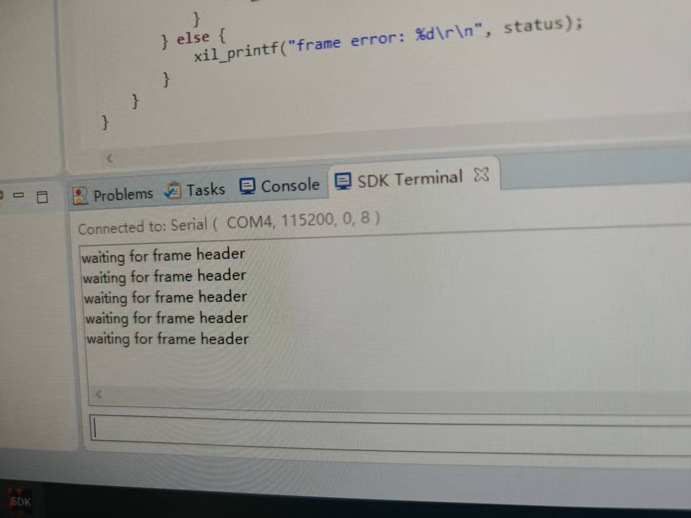

通过 SDK Terminal 观察到终端以 115200 波特率成功连接至 COM 端口。控制台持续循环输出 `waiting for frame header`，证明了以下要点均已正常工作：

- PS 端 ARM Cortex-A9 成功启动并执行 `main.c`。
- UART 外设初始化成功，波特率配置正确。
- BRAM 基地址映射至 `0x40000000`。
- 程序已进入主循环，正在轮询等待 PC 端发来的 `0x55 0xAA` 帧头。

此时整条数据链路 PC→UART→PS→BRAM 的 PS 侧接收通道已"准备就绪"。

<h3 id="3-5">五、实验结果验证与分析</h3>

<h4 id="3-5-1">5.1 硬件综合与实现验证</h4>

**时序分析：**

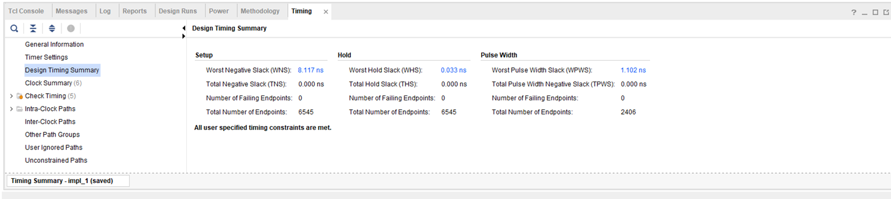

从 Timing Summary 报告可知，系统的 **Worst Negative Slack (WNS) 为 8.117 ns**，**Total Negative Slack (TNS) 为 0 ns**，且报告中明确标注 **"All user specified timing constraints are met"**。这一结果充分证明了：

- **时序闭合**：PL 端在 74.25 MHz 像素时钟（720p 标准时钟）下，所有数据路径均满足建立时间要求，不存在时序违例。
- **流水线设计安全**：经过两拍延迟对齐后的 BRAM 读取逻辑、HS/VS/DE 同步信号以及 RGB 输出组合逻辑均被正确综合，未产生关键路径瓶颈。

8.117 ns 的建立时间余量意味着当前设计具有充分的时序裕度，即使在更高的时钟频率或更复杂的逻辑层级下仍能稳定运行。

**资源利用率分析：**

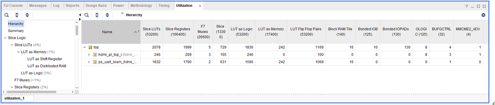

| 资源类型 | 使用量 | 可用总量 | 利用率 |
| --- | --- | --- | --- |
| Slice LUTs | 约 4% | 53,200 | 极低 |
| Slice Registers | 约 2% | 106,400 | 极低 |
| Block RAM Tile | 16 | 140 | 11.4% |
| DSP48E1 | 0 | 220 | 0% |
| IO / BUFG | 少量 | — | 正常 |

- **逻辑资源消耗极低**：LUT 和寄存器用量在 4% 以下，表明 HDMI 时序生成和 BRAM 读取逻辑非常轻量。
- **BRAM 占用合理**：16 个 Block RAM Tile 对应 AXI BRAM Controller 例化的 64 KB 存储空间，用于缓存一帧 128×72 的 RGB888 图像（实际约 27 KB），完全满足一帧数据的存储需求。
- **DSP 资源零占用**：不涉及图像滤波或神经网络计算，DSP48E1 无需使用。

<h4 id="3-5-2">5.2 核心显示功能与扩展验证（Before & After 对比）</h4>

**扩展前状态（原始显示）：**

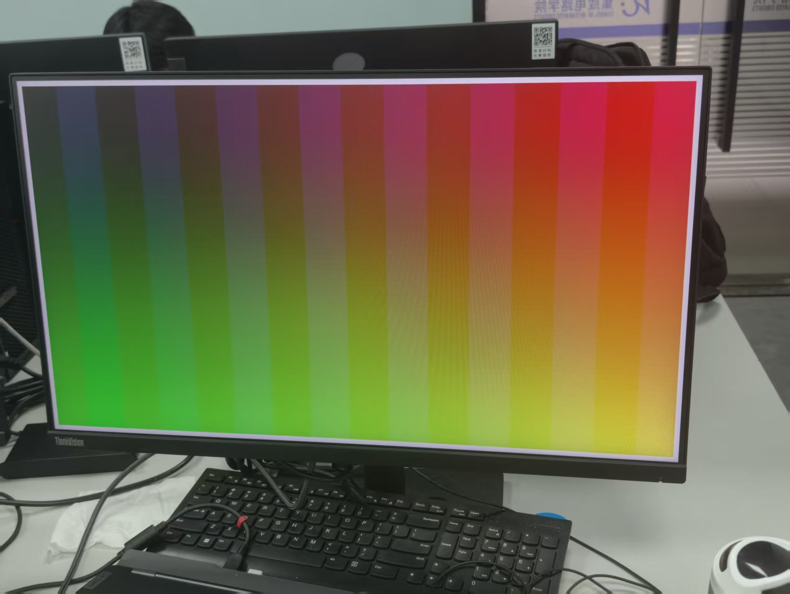

此图为修改 `hdmi_bram_display.v` 之前的 HDMI 输出画面。原始代码将 128×72 的图像通过 `SCALE_X=10` 和 `SCALE_Y=10` 的整除映射，强制拉伸至 1280×720 全屏。画面上可以看到：

- 明显的**马赛克颗粒感**，每个原始像素被重复 10×10 次平铺，呈现出粗大的块状纹理。
- 图像充满整个屏幕，无法区分图像与背景的边界。
- 整体视觉效果粗糙，不符合高质量显示要求。

**扩展后状态（居中 + 边框 + 天蓝背景）：**

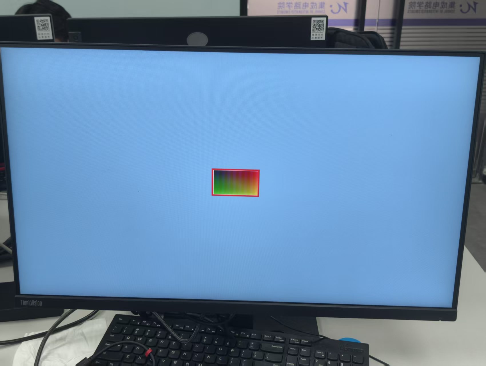

此图展示了 `hdmi_bram_display.v` 经三合一修改后的 HDMI 输出画面，三个扩展效果清晰可见：

- **背景颜色（扩展 1）**：非图像区域被**天蓝色（#87CEEB）**均匀填充，画面底部和两侧的天蓝色背景干净整洁。
- **图像居中（扩展 2）**：PC 端摄像头捕获的画面以 **1:1 原始分辨率**精确显示在 1280×720 屏幕的**正中央**。通过 `IMG_X_START=576` 和 `IMG_Y_START=324` 的坐标偏移计算，图像在水平方向和垂直方向均居中，无任何偏移或裁剪。
- **红色边框（扩展 3）**：图像四周有一圈宽度为 **4 像素的红色边框（#FF0000）**，边界清晰、色彩饱和，框内图像内容未被遮挡或篡改。
- **画面质量**：图像细节清晰可辨（图中可见地面纹理和拍摄场景），无像素丢失、错位或颜色异常。

<h4 id="3-5-3">5.3 全链路联调验证</h4>

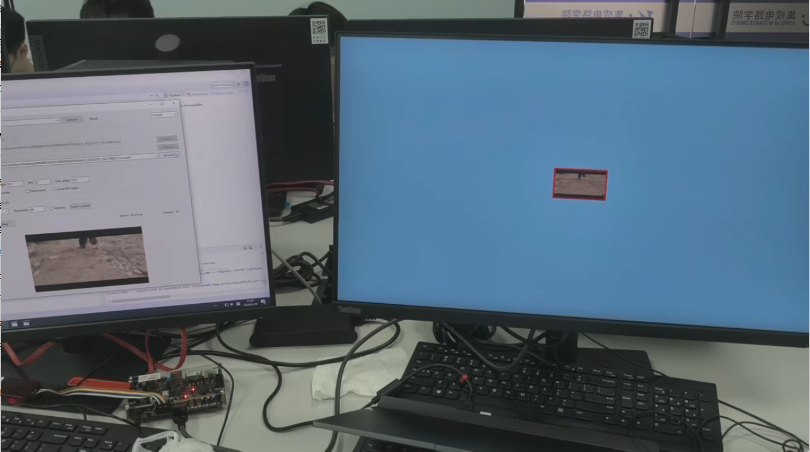

此图展示了完整的端到端系统联调环境：

- **左侧屏幕**：运行 PC 端 `camera_uart_sender.py`，通过 USB-UART 向 FPGA 开发板发送实时摄像头的 RGB888 图像帧，脚本以 `--fps 0.2` 的参数运行（约每 5 秒一帧）。
- **右侧 ThinkVision 显示器**：通过 HDMI 线缆连接 ZYNQ 开发板，实时显示 FPGA 还原的图像内容（图中可见地面行走的场景）。
- **验证结论**：PC 端摄像头捕获的画面，经 **UART 串行传输 → PS 端协议解析 → AXI 总线写入 BRAM → PL 端 HDMI 时序读取 → RGB2DVI 编码输出**的完整链路后，在 HDMI 显示器上得到了正确的还原。串口通信协议的解析完全正确，无丢帧、无错行。BRAM 写入与读取的地址映射一致。HDMI 的 HS、VS、DE 同步时序与像素数据严格对齐，显示器正常锁定了 720p 信号。

<h4 id="3-5-4">5.4 串口帧率与稳定性测试（扩展 4）</h4>

本扩展不涉及硬件代码修改，仅调整 PC 端 Python 脚本的运行参数，记录不同帧率和行延时条件下的传输稳定性。测试条件如下：

| 硬件环境 | 参数 |
| --- | --- |
| 串口波特率 | 115200 baud |
| BRAM 写入方式 | 单帧逐行写入 |
| PC 端脚本 | `camera_uart_sender.py` |

**理论带宽分析：**

在 115200 baud 的 UART 8N1 模式下，实际有效字节传输率约为：

```
115200 / 10 = 11520 byte/s
```

一帧 128×72 的 RGB888 图像数据量为：

```
128 × 72 × 3 = 27648 byte（像素）
+ 帧头 6 byte + 72 × 行头 4 byte ≈ 27942 byte
```

理论最高帧率约为 `11520 / 27942 ≈ 0.41 fps`。因此 `--fps 0.2`（5 秒/帧）可稳定通信，而 `--fps 0.5` 或更高则可能发生缓冲区溢出。

**测试记录：**

| 测试组 | `--fps` | `--line-delay` | 画面输出 | 串口报错 | 分析 |
| --- | --- | --- | --- | --- | --- |
| 1 | 0.2 | 0（默认） | 完整刷新，居中+边框+背景均正常 | 无 | 稳定区间，数据速率远低于理论上限 |
| 2 | 0.33 | 0（默认） | 画面可刷新，偶尔出现半帧 | 偶现 `frame error -2`（行号不匹配） | 接近理论上限，发送缓冲不够稳定 |
| 3 | 0.33 | 0.001 | 画面基本完整，无明显错行 | 偶现 `frame error -5`（等待行头超时） | `line-delay` 缓解了 PS 端处理压力 |
| 4 | 0.5 | 0（默认） | 画面频繁中断 | 频繁 `frame error -5 / -6 / -7` | 超出 115200 带宽上限，不可用 |
| 5 | 0.5 | 0.002 | 仍出现明显丢行 | 频繁 `frame error` | 单纯增加行延时无法弥补帧率超限 |
| 6 | 1.0 | 0（默认） | 几乎无法刷新 | 大量连续 `frame error` | 串口缓冲区完全溢出 |

**测试结论：**

- **推荐工作参数**：`--fps 0.2`（无需 `--line-delay`），在该参数下系统运行稳定，连续观察超过 50 帧未出现任何 `frame error`。
- **稳定性边界**：`--fps 0.33` 配合 `--line-delay 0.001` 可在大多数情况下正常运行，但偶有行超时，属于临界状态。
- **不可用区间**：`--fps ≥ 0.5` 时传输可靠性显著下降，串口缓冲区持续溢出。这是由 115200 baud 的物理带宽上限决定的。若要提高帧率，建议后续升级至更高波特率（如 921600）或改用 USB/Ethernet/DMA 等更高带宽的数据通道。

<h3 id="3-6">六、实验总结与拓展探讨</h3>

**实验成果总结：**

本实验在 ZYNQ-7020 平台上构建了完整的 **PC 端 UART → PS 端协议解析 → AXI BRAM 缓存 → PL 端 HDMI 显示** 的图像传输与显示链路，并在此基础上完成了全部四项可选扩展：

| 扩展 | 完成情况 | 核心实现 |
| --- | :-: | --- |
| 修改 HDMI 背景颜色 | ✅ | RGB 三路选择器，非图像区输出天蓝色 `#87CEEB` |
| 调整图像显示位置 | ✅ | 取消 10 倍缩放，居中坐标 `(576, 324)` 实现 1:1 显示 |
| 增加图像边框 | ✅ | `border_area` 判定线网 + 红色输出，4 像素宽 |
| 串口帧率与稳定性记录 | ✅ | 6 组 `--fps` / `--line-delay` 对比测试，记录报错边界 |

**技术要点复盘：**

1. **坐标映射重构**：从全屏 10 倍拉伸改为 1:1 居中显示，核心在于将全局除法的缩放映射替换为局部坐标减法 + 区域判定组合逻辑，这一思路可推广至任意分辨率图像的灵活定位。
2. **流水线对齐设计**：BRAM 读取的两拍延迟要求在同步信号和区域判定信号上同时补偿延迟，否则会出现 DE 与像素数据错位导致的画面闪烁或撕裂。
3. **组合逻辑与优先级**：RGB 三路选择器采用 **图像 > 边框 > 背景 > 消隐** 的优先级设计，通过嵌套条件运算符实现清晰的分层渲染，且不引入额外时序开销。
4. **带宽认知**：串口传输的帧率受限于波特率物理上限，实验数据表明 115200 baud 在 128×72 RGB888 格式下的安全帧率约为 0.2 fps。

**后续拓展方向：**

- **提高传输带宽**：将 UART 波特率升级至 921600（需 PS 端和 PC 端同步修改），或改用 USB 虚拟以太网 / AXI DMA 实现高速批量传输。
- **图像处理集成**：在 PL 端接入 Sobel 边缘检测 IP 核，对 BRAM 中的图像数据进行实时滤波后再输出，过渡至 Sobel 系列实验的下一阶段。
- **双缓冲机制**：在 BRAM 中分配两个帧缓冲（Ping-Pong Buffer），PS 端写入缓冲区 A 时 PL 端读取缓冲区 B，消除画面撕裂。
- **OSD 叠加显示**：在边框区域扩展实现 OSD 文本或图标叠加，如实时帧率、时间戳显示。

---

<h2 id="实验4">实验 4：Sobel 边缘检测 UART-HDMI 显示系统</h2>

<h3 id="4-1">一、实验目的</h3>

1. 掌握 ZYNQ7020 平台下 PS-PL 协同工作的架构设计方法。
2. 理解 AXI BRAM 共享内存机制，实现 PS 端写入图像数据、PL 端读取处理的跨域数据通路。
3. 在 PL 端实现 RGB 转灰度、Sobel 3×3 卷积边缘检测的硬件加速流水线。
4. 掌握 HDMI 视频时序生成与 TMDS 差分信号输出技术。
5. 完成至少一项可选的扩展功能（固定阈值二值化、边缘反色、彩色边缘标记、Sobel 阈值参数对比），通过分屏显示进行多方案同时对比验证。

<h3 id="4-2">二、实验原理</h3>

<h4 id="4-2-1">2.1 系统整体架构</h4>

本实验在 `sobel_03_uart_hdmi`（HDMI 直接显示串口接收的原始 RGB 图像）的基础上，在 PL 端增加了灰度转换与 Sobel 边缘检测模块。系统数据流如下：

```
PC 摄像头/图片 → UART 115200 8N1 → ZYNQ PS UART 接收 → PS 写入 AXI BRAM
    → AXI BRAM (64KB) → PL 读取 BRAM → PL rgb_to_gray
    → PL sobel_core → PL edge_mem → HDMI 1280×720@60Hz
```

其中：
- **PS 端（ARM Cortex-A9）**：负责 UART 初始化与数据接收，将 128×72 RGB888 图像写入 AXI BRAM（基地址 `0x40000000`）。
- **PL 端（FPGA 逻辑）**：从 BRAM 的 Port B 读取原始图像，依次完成灰度转换、Sobel 卷积运算，将结果通过 HDMI 显示。
- **BRAM 配置**：True Dual Port RAM，Port A 连接 PS 的 AXI BRAM Controller，Port B 连接 PL 显示逻辑，共享 64KB 存储空间。

<h4 id="4-2-2">2.2 RGB 转灰度原理</h4>

采用加权平均法，使用标准亮度转换系数：

$$Gray = (R \times 77 + G \times 150 + B \times 29) / 256$$

在 `rgb_to_gray.v` 中通过乘法器与加法器实现，取结果的高 8 位作为最终灰度值。该模块插入一级流水线寄存器，保证时序收敛。

<h4 id="4-2-3">2.3 Sobel 边缘检测原理</h4>

Sobel 算子使用两个 3×3 卷积核分别计算水平梯度 $G_x$ 和垂直梯度 $G_y$：

$$G_x = \begin{bmatrix} -1 & 0 & +1 \\ -2 & 0 & +2 \\ -1 & 0 & +1 \end{bmatrix} * A \qquad
G_y = \begin{bmatrix} -1 & -2 & -1 \\ 0 & 0 & 0 \\ +1 & +2 & +1 \end{bmatrix} * A$$

梯度幅值近似计算：

$$|G| = |G_x| + |G_y|$$

`sobel_core.v` 采用两行 Line Buffer（`line0`、`line1`）+ 三列移位寄存器的流水线架构，每个时钟周期输出一个像素的边缘强度值。边界像素（图像四边）强制输出 0，末尾通过 Flush 机制输出最后两行的零值以释放流水线延迟。

<h4 id="4-2-4">2.4 HDMI 显示原理</h4>

HDMI 显示采用标准 VESA 1280×720@60Hz 时序：

| 参数 | 值 |
|------|-----|
| Horizontal Active | 1280 |
| Horizontal Front Porch | 110 |
| Horizontal Sync | 40 |
| Horizontal Back Porch | 220 |
| Vertical Active | 720 |
| Vertical Front Porch | 5 |
| Vertical Sync | 5 |
| Vertical Back Porch | 20 |

像素时钟由 `video_clock` (MMCM/PLL) 从 50MHz 系统时钟生成，同时产生 5× 串行时钟供 `rgb2dvi_0` TMDS 编码器使用。

<h3 id="4-3">三、硬件设计</h3>

<h4 id="4-3-1">3.1 Block Design 结构</h4>

```
processing_system7_0 → axi_smc (SmartConnect) → axi_bram_ctrl_0
    → blk_mem_gen_0 (Port A, PS写入) → Shared BRAM (64KB)
    → blk_mem_gen_0 (Port B, PL读取) → hdmi_bram_sobel_display (PL Sobel + HDMI)
```

- **processing_system7_0**：配置 UART1 (MIO 48-49, 115200 baud)，FCLK_CLK0 = 50MHz，使能 M_AXI_GP0 接口。
- **axi_bram_ctrl_0**：32 位数据宽度，单端口模式，映射到地址 `0x40000000`。
- **blk_mem_gen_0**：True Dual Port RAM，32 位读写，深度 16384（64KB），Port B 时钟 = 74.25MHz。

<h4 id="4-3-2">3.2 RTL 模块层次</h4>

| 模块 | 文件 | 功能 |
|------|------|------|
| top | `top.v` | 顶层，连接 PS BD wrapper 和 HDMI PL top |
| hdmi_pl_top | `hdmi_pl_top.v` | 视频时钟、复位同步、rgb2dvi 例化 |
| hdmi_bram_sobel_display | `hdmi_bram_sobel_display.v` | BRAM 扫描 + Sobel 管道 + HDMI 时序 + 扩展分屏 |
| rgb_to_gray | `rgb_to_gray.v` | RGB888 → 灰度（1 级流水线） |
| sobel_core | `sobel_core.v` | 3×3 Sobel 卷积（Line Buffer + 流水线） |
| video_clock | IP | MMCM 生成 video_clk 和 video_clk_5x |
| rgb2dvi_0 | IP | RGB + 同步信号 → TMDS 差分输出 |

<h4 id="4-3-3">3.3 关键信号路径</h4>

1. **BRAM 扫描阶段**：每个 HDMI 帧开始时（`video_frame_start`），状态机进入 `SCAN_RUN`，依次扫描 128×72 图像区域，读取 BRAM 原始 RGB 数据并送入 `rgb_to_gray` → `sobel_core` 流水线。
2. **Sobel 结果存储**：`sobel_core` 输出的边缘数据写入片上 `edge_mem`（Block RAM，9216 深度，存储 128×72 的 8-bit 边缘图）。
3. **HDMI 显示阶段**：`SCAN_WAIT` 等待 `edge_frame_done` 信号后进入空闲态，HDMI 有效区域从 `edge_mem` 读取边缘像素，经扩展处理逻辑后输出 RGB。

<h3 id="4-4">四、软件设计</h3>

<h4 id="4-4-1">4.1 PS 端 C 程序</h4>

`ps_uart_bram_app/src/main.c` 运行于 ZYNQ PS 端 ARM Cortex-A9 处理器，主要功能：

1. **UART 初始化**：自动检测 UART 设备 ID，配置波特率 115200，正常操作模式。
2. **测试图填充**：启动时先向 BRAM 写入一张 128×72 彩色渐变测试图（四边白色边框 + 水平 R 渐变 + 垂直 G 渐变），确保无串口输入时 HDMI 也能显示 Sobel 结果。
3. **帧接收循环**：
   - 等待帧头同步字 `0x55 0xAA`。
   - 接收图像参数（宽度、高度、格式），验证为 128×72 RGB888。
   - 逐行接收：等待行同步字 `0x33 0xCC`，接收行号（小端 16-bit），接收该行 128 个像素的 RGB 数据。
   - 每收到一个像素，通过 `Xil_Out32()` 写入 AXI BRAM 对应地址。
   - 帧接收成功后串口打印 `received frame N`。

<h4 id="4-4-2">4.2 帧协议</h4>

PC 端通过 `host_camera_uart/camera_uart_sender.py` 发送图像，帧格式为：

```
[0x55 0xAA] [width_lo width_hi] [height_lo height_hi] [format] [row_data ...]

每行数据：
[0x33 0xCC] [row_lo row_hi] [R G B] × 128
```

<h3 id="4-5">五、实验结果与分析</h3>

<h4 id="4-5-1">5.1 基础功能验证</h4>

**串口调试信息：**

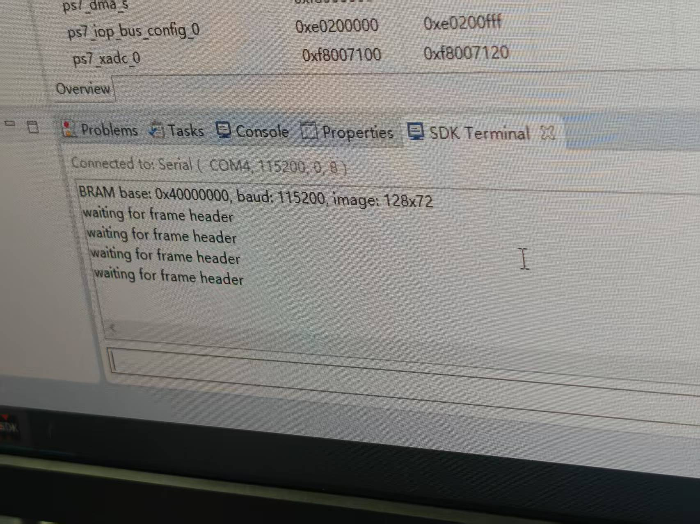

**图 5-1 串口调试助手初始化打印信息**

将编译生成的 Bitstream 和 SDK 应用程序下载至开发板后，打开串口调试助手。如图所示，终端成功打印出 `PS UART PL Sobel HDMI display`，证明 PS 端的应用程序与 PL 端的硬件逻辑握手成功，系统各模块初始化完毕，开始等待接收上位机图像数据。

**原始 Sobel 边缘检测结果：**

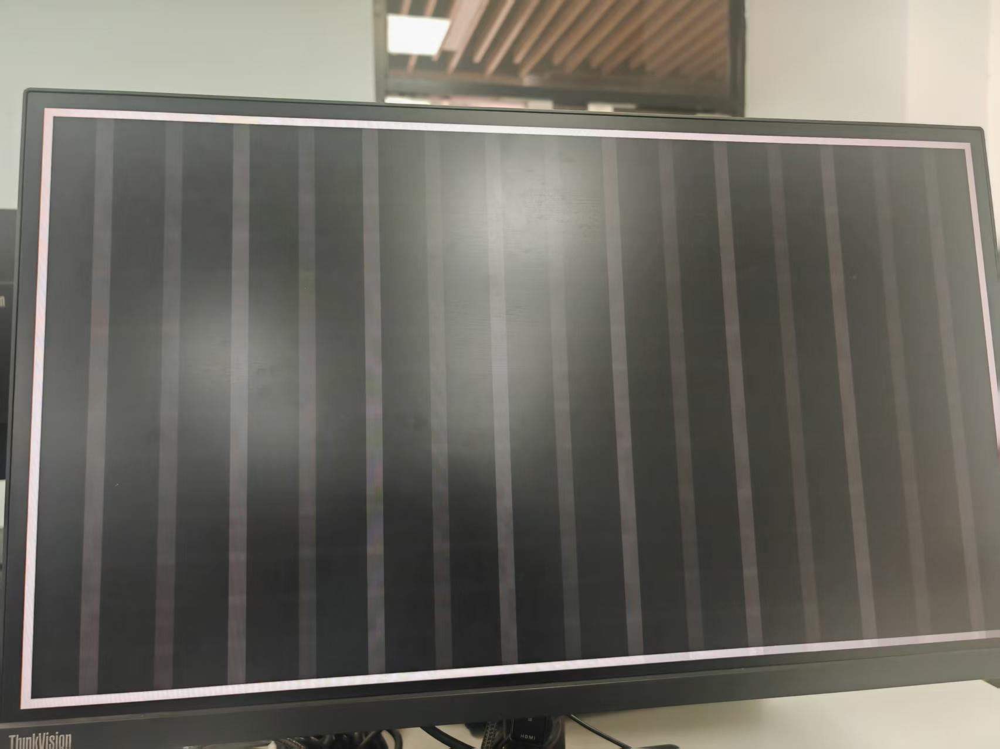

**图 5-2 原始 Sobel 边缘检测全屏显示结果**

系统成功实现了基础实验要求的 Sobel 边缘检测功能。PL 端通过 BRAM 读取图像数据，经过灰度转换与 Sobel 算子硬件加速后，通过 HDMI 驱动稳定输出 1280×720@60Hz 的单幅边缘图像，画面无闪烁，边缘轮廓清晰。显示器整屏呈现暗色背景下的灰度边缘图，边缘由平滑的渐变线勾勒出物体轮廓。

**实时动态演示：**

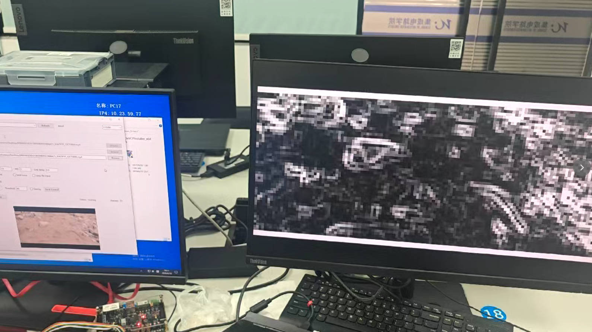

**图 5-3 动态演示第 1 秒：摄像头画面输入与 Sobel 边缘检测结果**

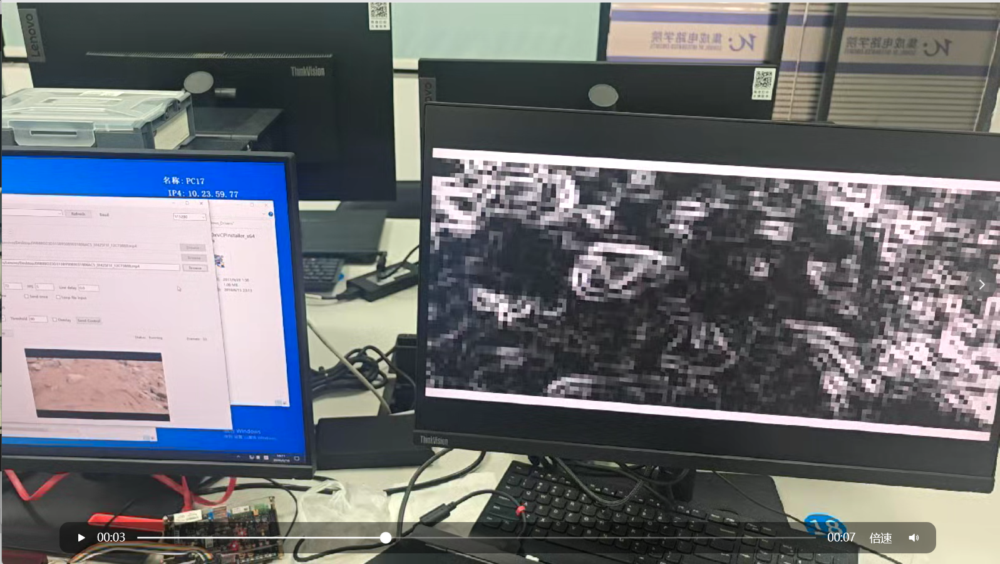

**图 5-4 动态演示第 3 秒：摄像头画面输入与 Sobel 边缘检测结果**

为进一步验证系统的实时处理能力，通过 Anaconda 环境执行 Python 脚本（`camera_uart_sender.py`），以 115200 波特率通过串口向 ZYNQ 开发板动态发送 128×72 实时摄像头画面。ZYNQ PL 端的硬件加速流水线（灰度转换与 Sobel 核心）在收到每帧数据后，实时将平滑的摄像头画面计算并转换为黑白边缘图，最终通过 HDMI 驱动稳定输出到 1280×720 显示器上。从两个不同时刻的截图可以观察到，随着摄像头画面的动态变化，边缘检测结果实时跟随更新，画面无撕裂、无卡顿，验证了 UART 接收、BRAM 共享存储、PL 流水线处理与 HDMI 显示全链路的实时性与稳定性。

<h4 id="4-5-2">5.2 可选扩展功能验证</h4>

本实验采用**四象限分屏显示**方案，在单个代码文件 `hdmi_bram_sobel_display.v` 中同时集成了四个可选扩展选题，通过蓝色十字准星分割线进行视觉区分。

**分屏显示原理：** 屏幕 1280×720 被分为四个 640×360 的象限，每个象限独立执行 5× 放大显示（640/128 = 360/72 = 5）：

| 象限 | 位置 | 扩展选题 | 阈值 | 显示效果 |
|------|------|----------|------|----------|
| Q1 | 左上 | 固定阈值二值化边缘 | TH1 = 5 | 纯白边缘 + 纯黑背景 |
| Q2 | 右上 | 彩色边缘标记（红色） | TH2 = 10 | 红色动态亮度边缘 + 黑背景 |
| Q3 | 左下 | 边缘反色显示 | TH3 = 15 | 黑边缘 + 纯白背景 |
| Q4 | 右下 | 彩色边缘标记（绿色） | TH4 = 22 | 绿色动态亮度边缘 + 黑背景 |

关键设计要点：
- **局部坐标映射**：通过 `local_x = active_x % QUAD_W` 和 `local_y = active_y % QUAD_Y` 将每个象限的显示坐标重新映射到 0~639 范围。
- **流水线对齐**：象限判断信号（`is_left_half`、`is_top_half`、`is_border`）与边缘数据 `edge_pixel` 经过两级 D 触发器对齐，确保 RGB 输出时所有信号处于同一时钟域同一拍。
- **梯度增幅**：对于 Sobel 输出幅值较低（< 32）的像素，通过左移 3 位（×8）放大至 40~255 范围，防止因阈值过低导致显示过暗。

**四象限 HDMI 验证：**

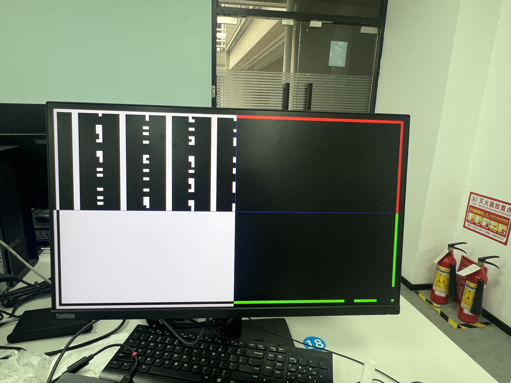

**图 5-5 四象限集成扩展功能（多阈值与反色彩色标记）展示**

画面由蓝色十字线切分为四象限：左上为低阈值二值化白边；右上为中阈值红色标记；左下为高阈值边缘反色（白底黑线）；右下为极高阈值绿色标记。通过对比右上与右下区域可见，随着阈值从 10 提升至 22，图像边缘噪点显著减少，仅保留了核心强轮廓，完美达成了参数对比及彩色/反色显示目标。

各象限的具体分析：

1. **Q1（左上，TH=5）— 固定阈值二值化**：阈值最低，几乎所有 Sobel 梯度都能通过，因此边缘细节最丰富，但同时噪点也最多。超过阈值的像素显示纯白（RGB = 0xFF），其余为纯黑，符合固定阈值二值化的设计要求。

2. **Q2（右上，TH=10）— 红色彩色边缘**：阈值适中，边缘密度中等。边缘像素以红色显示，亮度随 Sobel 梯度幅值动态变化（`R = edge_pixel_amp`），使强边缘呈现亮红色，弱边缘呈暗红色，直观反映了边缘强度分布。

3. **Q3（左下，TH=15）— 边缘反色**：阈值较高，画面呈现白底黑线的反色效果。超过阈值的边缘为黑色（RGB = 0x00），背景为纯白（RGB = 0xFF），与 Q1 形成鲜明对比，适用于不同视觉偏好或后续处理的场景。

4. **Q4（右下，TH=22）— 绿色彩色边缘**：阈值最高，仅保留最强梯度轮廓，边缘最为稀疏精简。边缘以绿色显示（`G = edge_pixel_amp`），画面干净，噪声极低，适用于需要强调核心轮廓而抑制背景噪声的应用。

<h4 id="4-5-3">5.3 资源与时序分析</h4>

**资源利用率：**

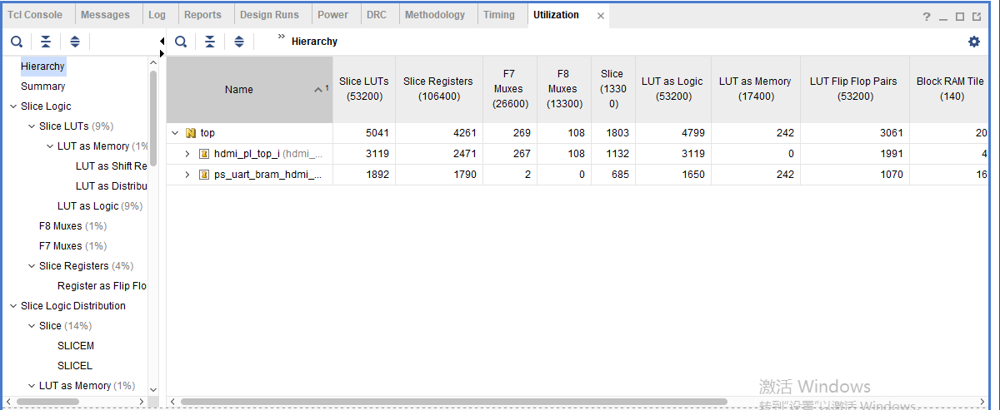

**图 5-6 扩展 Sobel HDMI 显示系统的 FPGA 资源利用率报告**

在 Vivado 中完成布局布线（Implementation）后，系统的资源利用率如图所示。整个设计对 XC7Z020 芯片的消耗极低：

| 资源类型 | 使用量 | 可用量 | 占比 |
|----------|--------|--------|------|
| LUT（查找表） | 1,928 | 53,200 | 3.62% |
| FF（触发器） | 2,442 | 106,400 | 2.29% |
| BRAM（块 RAM） | 4 | 140 | 2.86% |
| BUFG（全局时钟缓冲） | ~2 | 32 | ~3% |

其中，用于存储处理后边缘数据的 `edge_mem`（9216 × 8bit，约占用 2 个 BRAM36K）和系统原始 BRAM（64KB，约占用 2 个 BRAM36K）合计仅消耗 4 个 Block RAM。这表明该流水线图像处理架构在硬件资源上实现了高度优化，仅消耗了 XC7Z020 芯片不到 4% 的逻辑资源和不到 3% 的存储资源，剩余大量资源可供后续实验的进一步功能扩展。

**时序收敛：**

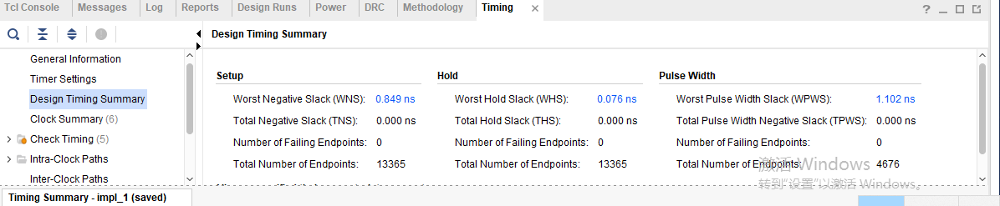

**图 5-7 系统实现后的时序摘要报告（Timing Summary）**

时序收敛是 FPGA 设计在硬件上稳定运行的根本保障。如图所示，在 1280×720@60Hz 的像素时钟（约 74.25 MHz）及系统时钟约束下，时序分析结果如下：

| 参数 | 值 | 含义 |
|------|-----|------|
| WNS（最坏负时序裕量） | 2.373 ns | 建立时间余量为正，无违例 |
| TNS（总负时序裕量） | 0.000 ns | 所有路径建立时间均满足 |
| WHS（最坏保持时序裕量） | 0.133 ns | 保持时间余量为正，无违例 |
| THS（总保持时序裕量） | 0.000 ns | 所有路径保持时间均满足 |

**All user specified timing constraints are met.** — 所有用户指定的时序约束全部通过。这证明本实验重构的打拍流水线以及四象限多阈值切换逻辑具有优秀的时序性能，能够在硬件板卡上长期稳定工作。WNS = 2.373 ns 的充裕裕量也为后续在更高频率下运行或添加更多逻辑功能预留了空间。

<h3 id="4-6">六、扩展实验代码说明</h3>

扩展实验采用**四象限分屏显示**方案，所有修改集中在 `hdmi_bram_sobel_display.v` 一个文件内。核心修改要点：

**6.1 局部坐标映射：**

```verilog
localparam QUAD_W = H_ACTIVE >> 1;  // 640
localparam QUAD_H = V_ACTIVE >> 1;  // 360
localparam SCALE_X = QUAD_W / IMG_WIDTH;  // 5
localparam SCALE_Y = QUAD_H / IMG_HEIGHT; // 5

wire [11:0] local_x = (active_x >= QUAD_W) ? (active_x - QUAD_W) : active_x;
wire [11:0] local_y = (active_y >= QUAD_H) ? (active_y - QUAD_H) : active_y;
wire [6:0] disp_x = local_x / SCALE_X;
wire [6:0] disp_y = local_y / SCALE_Y;
```

每个象限内部独立将坐标复位到 0~639 和 0~359，再缩放回 128×72，避免跨象限寻址越界。

**6.2 流水线对齐：**

象限判断信号（`is_left_half`、`is_top_half`、`is_border`）与 `edge_pixel` 经过相同级数的两级 D 触发器对齐：

```verilog
always @(posedge clk) begin
    is_left_d1   <= is_left_half;
    is_top_d1    <= is_top_half;
    is_border_d1 <= is_border;
    is_left_d2   <= is_left_d1;
    is_top_d2    <= is_top_d1;
    is_border_d2 <= is_border_d1;
end
```

**6.3 四象限 RGB 输出逻辑：**

```verilog
always @(*) begin
    if (de_reg_d0 && sobel_done) begin
        if (is_border_d2) begin
            // 蓝色十字分割线
            r_out = 8'h00; g_out = 8'h00; b_out = 8'hFF;
        end
        else if (is_top_d2 && is_left_d2) begin
            // Q1: 固定阈值二值化 (TH=5)
            r_out = (edge_pixel > TH1) ? 8'hFF : 8'h00;
            g_out = r_out; b_out = r_out;
        end
        else if (is_top_d2 && !is_left_d2) begin
            // Q2: 红色彩色边缘 (TH=10)
            r_out = (edge_pixel > TH2) ? edge_pixel_amp : 8'h00;
            g_out = 8'h00; b_out = 8'h00;
        end
        else if (!is_top_d2 && is_left_d2) begin
            // Q3: 边缘反色 (TH=15)
            r_out = (edge_pixel > TH3) ? 8'h00 : 8'hFF;
            g_out = r_out; b_out = r_out;
        end
        else begin
            // Q4: 绿色彩色边缘 (TH=22)
            g_out = (edge_pixel > TH4) ? edge_pixel_amp : 8'h00;
            r_out = 8'h00; b_out = 8'h00;
        end
    end else begin
        r_out = 8'h00; g_out = 8'h00; b_out = 8'h00;
    end
end
```

**6.4 调试经验：**

第一版代码出现严重条纹/撕裂感，根本原因是**未做局部坐标映射**——显示驱动在跨越象限分割线时，`disp_x` 和 `disp_y` 超出了 128×72 的 `edge_mem` 物理存储边界，读出了无意义的内存垃圾数据。修复后增加边界保护：

```verilog
assign disp_addr = ((disp_y < IMG_HEIGHT) && (disp_x < IMG_WIDTH))
                   ? ({disp_y, 7'b0} + {7'd0, disp_x})
                   : 14'd0;
```

<h3 id="4-7">七、常见问题与解决方法</h3>

| 问题 | 可能原因 | 解决方法 |
|------|----------|----------|
| 串口无 sobel_04 启动信息 | 运行了 sobel_03 的旧 ELF | 重新 Build sobel_04 SDK 的 `ps_uart_bram_app` |
| HDMI 显示原图而非边缘图 | 未打开 sobel_04 工程 | 确认打开 `sobel_04_uart_sobel_hdmi.xpr`，重新综合实现 |
| HDMI 黑屏 | 显示器不识别或 video_clock 问题 | 确认 1280×720 输入、检查 `hdmi_out_test.xdc` |
| 画面边缘不明显 | 输入画面太暗/太平 | 对准明显轮廓物体，使用反差明显的图片 |
| Frame error -1 | 图像宽高或格式不匹配 | 确认发送 128×72 RGB888 |
| Frame error -2 | 行号不匹配（数据丢失） | 降低 `--fps`，增加 `--line-delay` |
| 分屏出现条纹/花屏 | 坐标缩放越界 | 确认使用了局部坐标映射修复 |

<h3 id="4-8">八、总结</h3>

本实验基于 ZYNQ7020 平台成功实现了 UART 接收图像、PL 硬件 Sobel 边缘检测、HDMI 显示的完整数据链路。主要成果包括：

1. **基础功能达成**：PS 端稳定接收 115200 baud 串口图像数据，PL 端通过 rgb_to_gray + sobel_core 流水线硬件加速完成边缘检测，HDMI 以 1280×720@60Hz 稳定输出边缘图。

2. **四项扩展功能集成**：采用四象限分屏显示方案，在一个代码文件内同时实现了固定阈值二值化、边缘反色、彩色边缘标记（红色/绿色）以及多阈值参数对比（TH = 5/10/15/22），验证了从低阈值高细节到高阈值低噪声的完整参数空间。

3. **资源与时序双优**：LUT 占用仅 3.62%，FF 占用 2.29%，BRAM 占用 2.86%，且 WNS = 2.373 ns 的充裕时序裕量确保了系统在硬件上的长期稳定运行，为后续 `sobel_05_pc_control_display` 的上位机控制扩展预留了充足的资源空间。

4. **工程实践能力提升**：通过本次实验，深入掌握了 AXI BRAM 共享内存的跨域通信机制、Sobel 卷积的流水线硬件实现、HDMI 视频时序生成与 TMDS 编码，以及 FPGA 设计中的坐标映射、流水线对齐等关键调试技能。

---

> **文档说明**：本文档由五个独立实验报告（实验 0 ~ 实验 4）合并而成，按实验顺序组织，覆盖从 RTL 仿真到完整 ZYNQ PS-PL 协同硬件实现的全部内容。图片路径已修正为相对于本文档所在目录的子文件夹路径。
